# Lab 01 — Domain Controller Deployment (AD DS + DNS)

## Objective

Deploy a Windows Server 2022 domain controller from scratch on a Proxmox VE hypervisor, creating a new Active Directory forest (`homelab.local`) with integrated DNS, and verify that the domain controller is healthy and discoverable by future domain clients.

This domain controller is the foundation for the rest of the labs in this repository (OUs, users and groups, client domain join, help desk tickets, file shares, and Group Policy).

---

## Environment / Topology

```
                Home router / DHCP (192.168.100.1)
                              |
                     LAN 192.168.100.0/24
                              |
        Proxmox VE host "pve" (192.168.100.50)
        Dell OptiPlex 7060 — i5-8500, 24 GB RAM
                              |
                    vmbr0 (Linux bridge)
                              |
                VM 100 — DC01 (192.168.100.10)
         Windows Server 2022 Standard Evaluation
                 Domain: homelab.local (HOMELAB)
```

| Component | Configuration |
|---|---|
| Hypervisor | Proxmox VE 9.2.11 |
| VM | ID 100, name `DC01` |
| OS | Windows Server 2022 Standard Evaluation (Desktop Experience) |
| Firmware / chipset | OVMF (UEFI) with pre-enrolled Secure Boot keys, q35, TPM 2.0 |
| CPU / RAM | 2 cores (type `host`), 4096 MB |
| Disk | 60 GB on `local-lvm`, VirtIO SCSI single, discard + SSD emulation enabled |
| Network | VirtIO NIC bridged to `vmbr0` |
| IP configuration | `192.168.100.10/24`, gateway `192.168.100.1`, DNS `192.168.100.10` (itself) |
| Time zone | Central America Standard Time (UTC-06:00) |
| Domain | `homelab.local`, NetBIOS `HOMELAB`, forest/domain functional level Windows Server 2016 |
| DC roles | AD DS, DNS Server, Global Catalog |

---

## Steps

### 1. Create the virtual machine in Proxmox

Created VM 100 with the Windows 11/2022/2025 guest profile, UEFI firmware, TPM 2.0 and VirtIO devices for disk and network. Both the Windows Server ISO and the VirtIO drivers ISO (`virtio-win-0.1.285.iso`) were attached.

- **Why UEFI + q35:** emulates modern hardware and enables Secure Boot.
- **Why VirtIO:** paravirtualized devices offer much better disk and network performance than emulated SATA/e1000 hardware, at the cost of needing extra drivers during installation.
- **Why QEMU Guest Agent:** lets the hypervisor communicate with the guest (clean shutdowns, reporting the VM's IP).

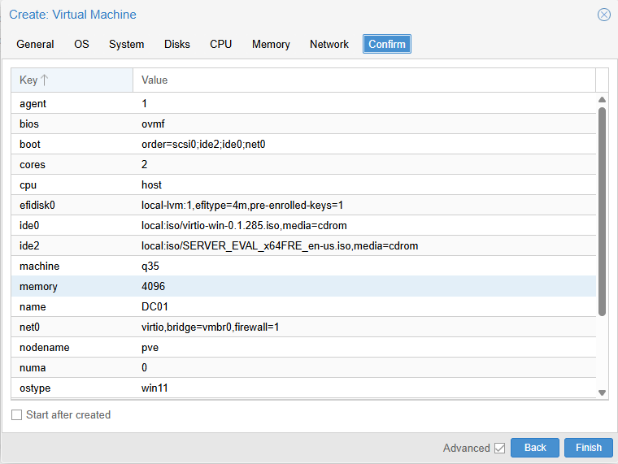
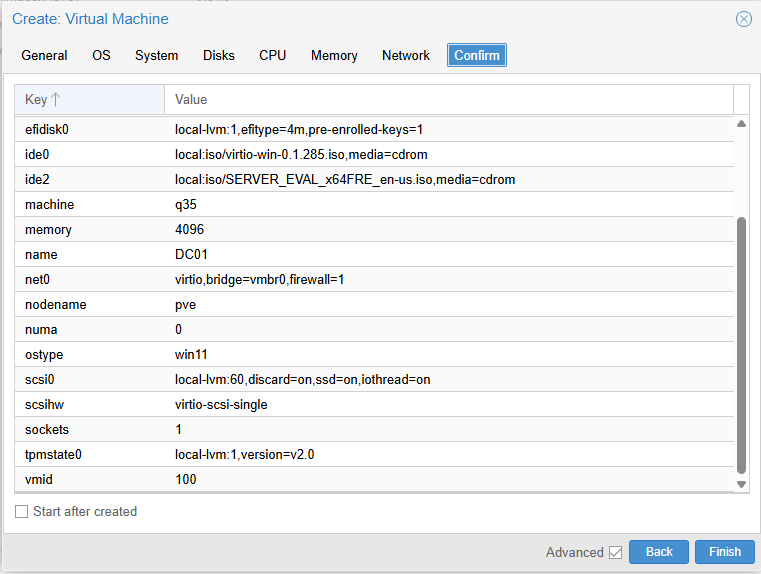

### 2. Boot from the installation ISO

On the first boot the "Press any key to boot from CD or DVD" prompt timed out, UEFI skipped the non-bootable VirtIO ISO and fell back to PXE network boot. I used the UEFI boot menu to manually select the DVD drive that held the Windows Server ISO, identifying it from the earlier boot error messages.

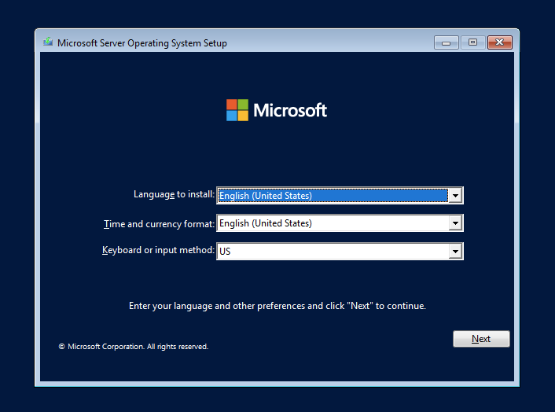

### 3. Install Windows Server — load the VirtIO SCSI driver

Selected **Windows Server 2022 Standard Evaluation (Desktop Experience)** and a custom installation.

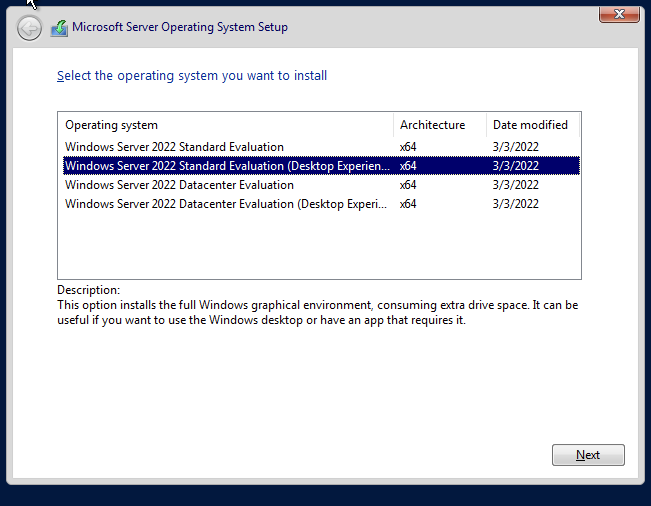

**Issue:** the installer showed no drives.
**Cause:** the virtual disk is attached through a VirtIO SCSI controller, and Windows does not include a driver for it.
**Fix:** loaded the `vioscsi` driver from the VirtIO ISO (`vioscsi\2k22\amd64`), after which the 60 GB disk appeared.

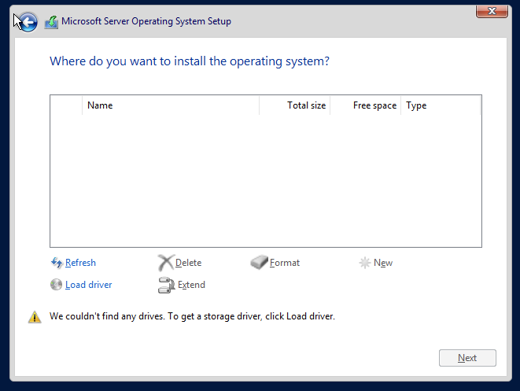
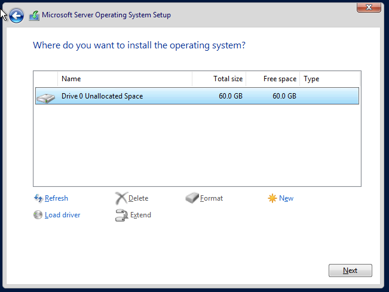

### 4. Install the remaining VirtIO drivers

After the first login, Device Manager showed three devices without drivers: Ethernet Controller (VirtIO network), PCI Device (VirtIO balloon) and PCI Simple Communications Controller (VirtIO serial, used by the guest agent). Without the network driver the server had no connectivity.

I ran `virtio-win-guest-tools.exe` from the VirtIO ISO, which installed all drivers and the QEMU Guest Agent in one step.

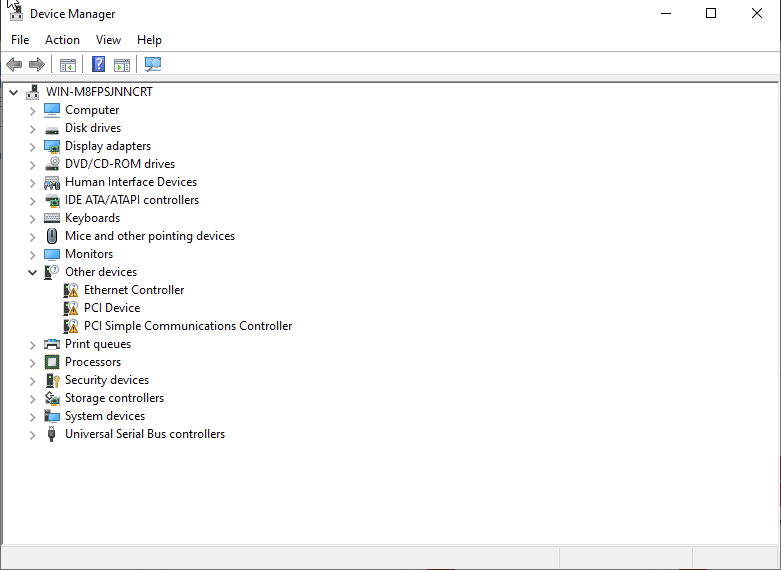
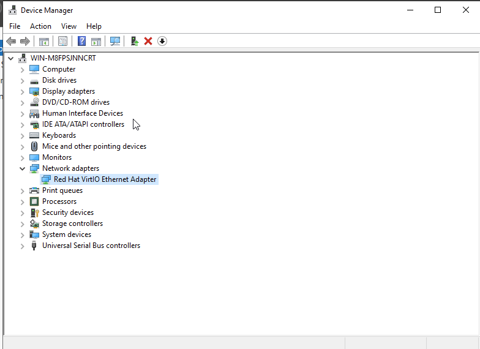

### 5. Configure a static IP address

The server initially received `192.168.100.57` via DHCP. A domain controller must have a static IP because every domain member locates it through DNS; if its address changed, clients would lose contact with the domain.

Before assigning `192.168.100.10`, I confirmed with `ping` that no other device was using it, to avoid an IP conflict.

The preferred DNS server was set to the DC's own IP, with no alternate. Active Directory depends on SRV records that only exist in the domain's DNS, so pointing the DC at an external DNS server (such as the router) would cause intermittent lookup failures.

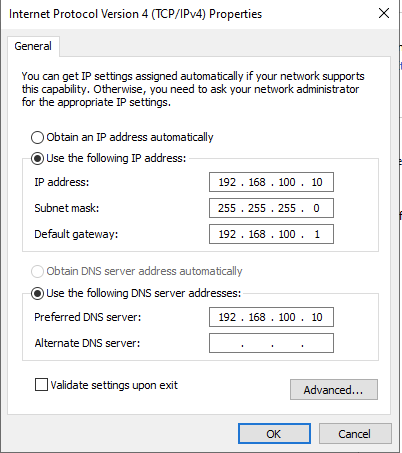

### 6. Set the time zone and rename the server

- Set the time zone to Central America Standard Time. Kerberos authentication fails when the clock difference between a client and the DC exceeds 5 minutes, so correct time is critical.
- Renamed the server from the random `WIN-M8FPSJNNCRT` to `DC01` **before** promotion, because renaming a domain controller afterwards requires updating DNS records and AD objects.

### 7. Install the AD DS role

Installed Active Directory Domain Services and its management tools (ADUC, Group Policy Management, AD PowerShell module, AD Administrative Center).

Installing the role only adds the binaries. The server does not become a domain controller until it is promoted.

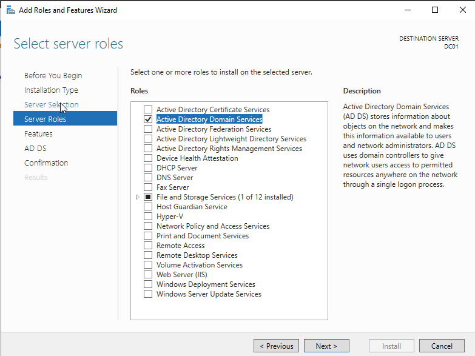
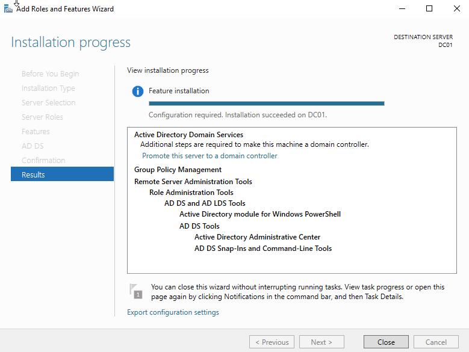

### 8. Promote the server to a domain controller

- Deployment: **Add a new forest**, root domain `homelab.local`.
- Options: DNS Server and Global Catalog enabled; not a read-only DC; DSRM password set and stored in a password manager.
- DNS delegation: not created. The warning appears because no authoritative parent zone exists for `.local`; delegation is only required when the AD domain is a child of an existing DNS hierarchy.
- NetBIOS name: `HOMELAB`. Default paths for NTDS and SYSVOL.
- Prerequisites check passed; the two warnings (NT 4.0 cryptography compatibility disabled by default, and DNS delegation) were reviewed and required no action.

After promotion the server rebooted automatically, and the former local Administrator account became `HOMELAB\Administrator`.

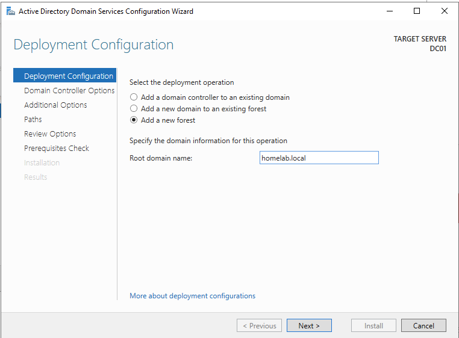
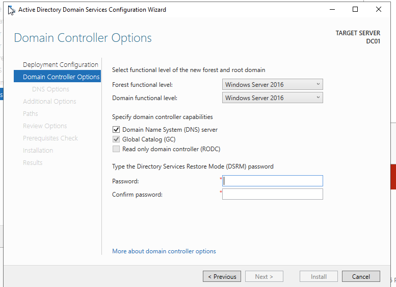
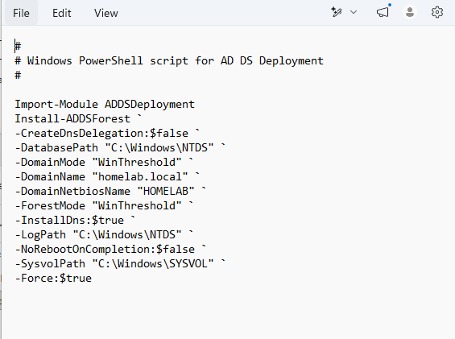
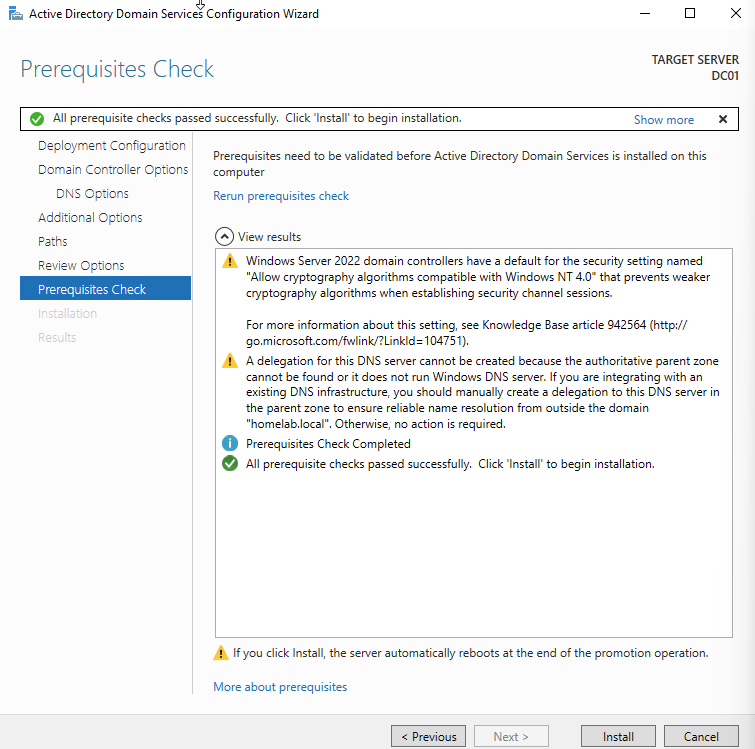

---

## Verification

Server Manager shows AD DS, DNS and File and Storage Services as healthy.

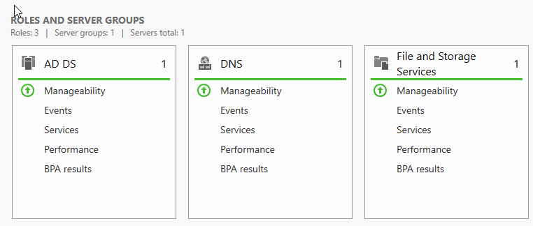

| Test | Command | Result |
|---|---|---|
| Static IP applied | `ipconfig /all` | DHCP disabled, `192.168.100.10`, DNS `192.168.100.10` |
| Hostname | `hostname` | `DC01` |
| Time zone | `Get-TimeZone` | Central America Standard Time |
| Server is a DC of the right domain | `Get-ADDomainController` | `DC01`, `homelab.local`, `192.168.100.10`, Global Catalog `True` |
| Critical services | `Get-Service ADWS, KDC, Netlogon, DNS` | All `Running` |
| Domain name resolution | `nslookup homelab.local` | `192.168.100.10` |
| DC locator SRV record | `nslookup -type=SRV _ldap._tcp.dc._msdcs.homelab.local` | `dc01.homelab.local`, port 389 |

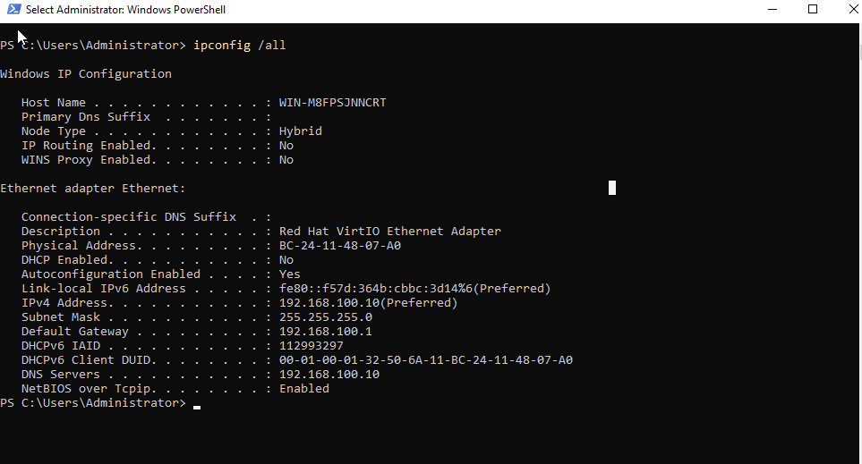
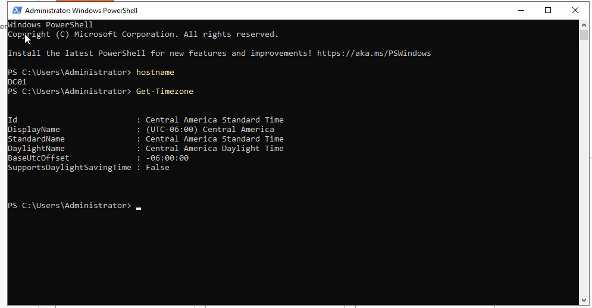
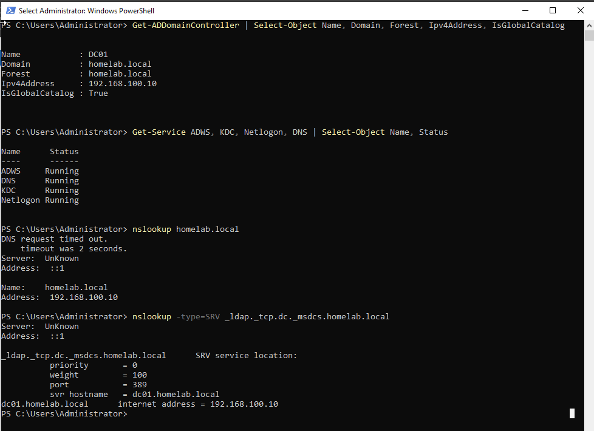

**Note on the nslookup output:** `Server: UnKnown` and the initial `DNS request timed out` come from nslookup trying to resolve the DNS server's own name through a reverse lookup. No reverse lookup zone exists yet, so that query fails, but the actual forward lookups succeed. This does not affect the domain.

The SRV record test is the most important one: domain clients do not look up the DC by IP, they query DNS for this record. If it fails, clients cannot join the domain.

---

## What I learned

- **Paravirtualized hardware needs drivers.** The disk existed, but Windows could not see it until I loaded the VirtIO SCSI driver. Emulated SATA would have worked out of the box, but with lower performance.
- **Reading boot errors.** The UEFI messages (timeout on one DVD drive, "Not Found" on the other, then PXE) told me which virtual drive held the bootable ISO.
- **Verify before changing.** Pinging the target IP before assigning it prevents IP conflicts.
- **A DC must use itself for DNS.** Active Directory relies on SRV records hosted in its own DNS zone.
- **Installing a role is not the same as promoting a server.** The first adds the software; the second creates the forest, domain, AD database, DNS zone and SYSVOL.
- **Time matters.** Kerberos tolerates a maximum 5-minute clock difference.
- **Not every warning is an error.** Both promotion warnings were expected for a standalone forest.
- **Credential management.** The domain Administrator and DSRM passwords are the keys to the whole domain; they belong in a password manager, not in memory.
- **Known limitation:** Microsoft recommends using a subdomain of a registered public domain (for example `ad.company.com`) instead of `.local`, which can conflict with mDNS. `.local` is acceptable for an isolated lab.

---

## Commands reference

| Purpose | Command |
|---|---|
| Show full IP configuration | `ipconfig /all` |
| Check whether an IP is already in use | `ping 192.168.100.10` |
| Show the current time zone | `Get-TimeZone` |
| Set the time zone | `Set-TimeZone -Id "Central America Standard Time"` |
| Rename the server and restart | `Rename-Computer -NewName "DC01" -Restart` |
| Show the hostname | `hostname` |
| Install the AD DS role (PowerShell equivalent of the GUI step) | `Install-WindowsFeature AD-Domain-Services -IncludeManagementTools` |
| Show DC details | `Get-ADDomainController \| Select-Object Name, Domain, Forest, IPv4Address, IsGlobalCatalog` |
| Check critical AD services | `Get-Service ADWS, KDC, Netlogon, DNS \| Select-Object Name, Status` |
| Resolve the domain name | `nslookup homelab.local` |
| Verify the DC locator SRV record | `nslookup -type=SRV _ldap._tcp.dc._msdcs.homelab.local` |

The exact promotion script generated by the wizard ("Review Options > View script") is saved in [`scripts/promote-dc.ps1`](scripts/promote-dc.ps1).
