# Lab 02 — Domain Structure, Users, Groups and Client Domain Join

## Objective

Build an organized Active Directory structure for a small company (`homelab.local`), create users and security groups using both the GUI and PowerShell, prepare the domain controller to receive clients, and join a Windows 11 workstation to the domain so a domain user can sign in.

Along the way, a first attempt to host the client on a type 2 hypervisor failed. The troubleshooting process and the decision that followed are documented in their own section.

---

## Environment / Topology

```
                  ISP router (192.168.100.1)
                  Gateway + DHCP + internet
                             |
                 TP-Link TL-SG108PE switch
                   |                     |
          Ethernet cable          Ethernet cable
                   |                     |
    Dell OptiPlex 7060 / Proxmox    MSI desktop (admin workstation)
        (192.168.100.50)            Proxmox web UI + RDP to DC01
                   |
             vmbr0 (bridge)
             |            |
   DC01 (192.168.100.10)  WS02 (DHCP, DNS -> 192.168.100.10)
   Windows Server 2022    Windows 11 Pro
```

| Component | Configuration |
|---|---|
| Domain | `homelab.local` (NetBIOS `HOMELAB`), built in [Lab 01](../Lab01-DC-Setup/) |
| DC01 | Proxmox VM 100, Windows Server 2022, `192.168.100.10` |
| WS02 | Proxmox VM 101, Windows 11 Pro, q35 / OVMF (UEFI) / TPM 2.0, 2 cores (`host`), 6144 MB RAM, 64 GB VirtIO SCSI disk, VirtIO NIC on `vmbr0`, QEMU Guest Agent |
| WS02 network | IP from the router via DHCP (`192.168.100.58`), DNS set manually to DC01 |
| MSI desktop | Admin workstation: manages Proxmox through the browser and DC01 through Remote Desktop |

---

## Steps

### Part A — Domain structure (on DC01)

#### 1. Design the OU structure

The default `Users` and `Computers` objects are **containers**, not OUs: Group Policy cannot be linked to them, they cannot hold sub-OUs, and they are hard to delegate. I created a dedicated OU tree instead:

```
homelab.local
└── HOMELAB
    ├── Departments
    │   ├── IT
    │   ├── Sales
    │   └── HR
    ├── Groups
    └── Workstations
```

Every OU kept **Protect container from accidental deletion** enabled.

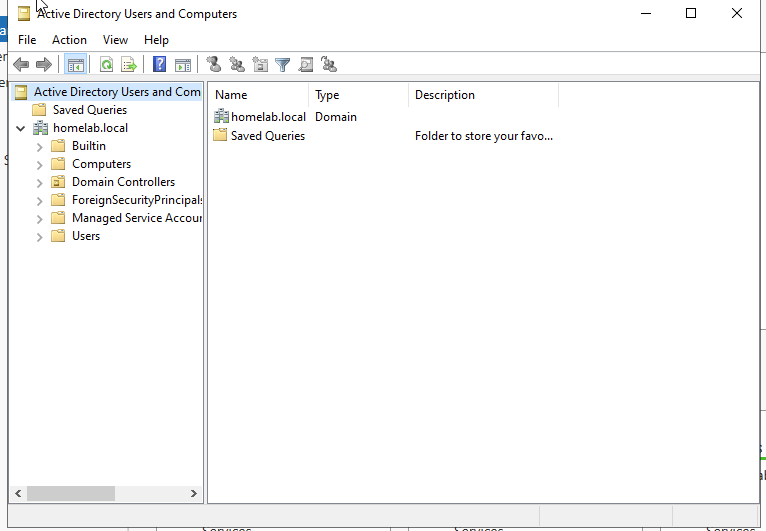
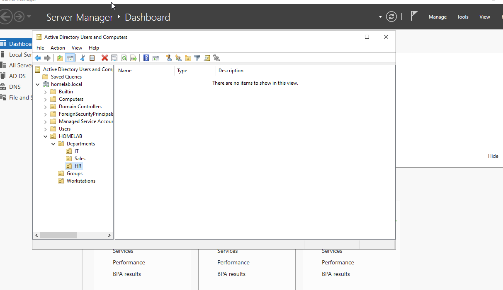

#### 2. Create the first user in the GUI

Created **Ana Mora** (`amora`) in the IT OU, using the naming convention *first initial + last name*. The account requires a password change at next logon, so IT never knows the user's final password.

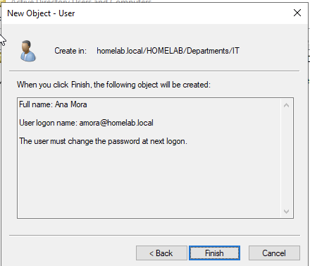
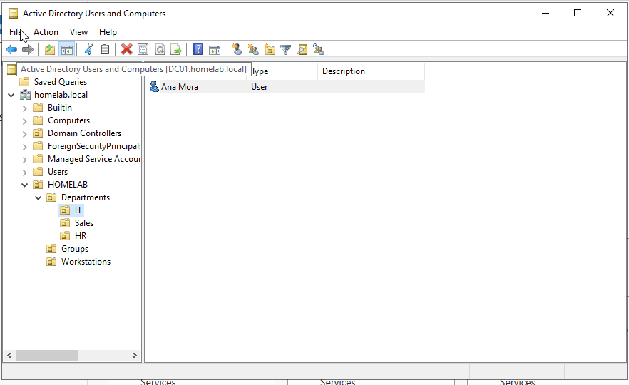

#### 3. Enable Remote Desktop on DC01

Long PowerShell commands are impractical to type in the hypervisor console, so I enabled Remote Desktop with **Network Level Authentication** and administered DC01 from the MSI. RDP is only reachable inside the LAN; port 3389 is not forwarded on the router.

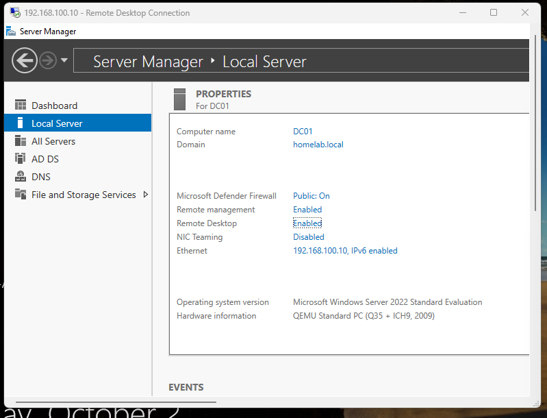

#### 4. Create the remaining users with PowerShell

The temporary password was read as a `SecureString`, so it never appears in plain text on screen or in the PowerShell history. `-Enabled $true` is required because `New-ADUser` creates disabled accounts by default.

| User | Logon name | Department OU |
|---|---|---|
| Ana Mora | `amora` | IT (GUI) |
| Carlos Rojas | `crojas` | Sales |
| Laura Vargas | `lvargas` | Sales |
| Sofia Jimenez | `sjimenez` | HR |

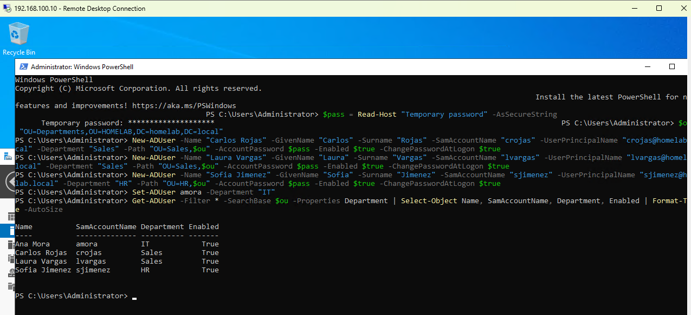

#### 5. Create security groups

Created one **Global Security** group per department in the Groups OU, using the `GG-` (Global Group) naming prefix. Permissions are assigned to groups, never to individual users, so onboarding and offboarding become a matter of group membership.

| Group | Members |
|---|---|
| GG-IT | amora |
| GG-Sales | crojas, lvargas |
| GG-HR | sjimenez |

OUs decide **where an object lives**; groups decide **what it can access**. Carlos and Laura still live in the Sales OU while being referenced by GG-Sales.

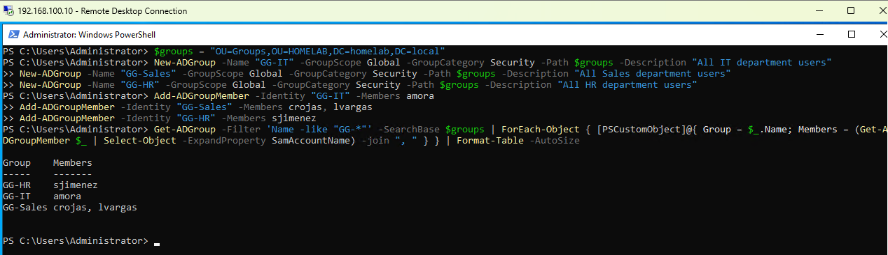
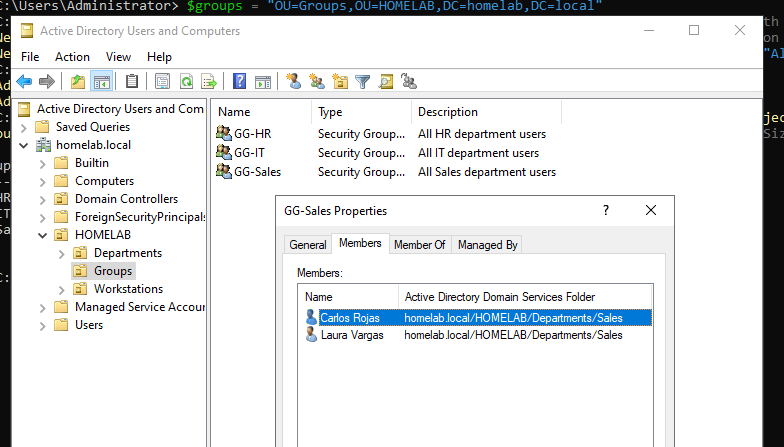

#### 6. Prepare DC01 for clients

- **DNS forwarder:** clients will use DC01 as their only DNS server, so DC01 must also resolve internet names. `Add-DnsServerForwarder` returned a warning: the router (`192.168.100.1`) was already configured as a forwarder, added automatically during promotion. Lesson: check the current state (`Get-DnsServerForwarder`) before changing it.
- **Default computer location:** `redircmp` redirects newly joined computers from the `Computers` container to the **Workstations** OU, so they can receive Group Policy without being moved manually.

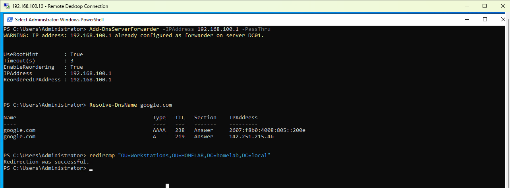

### Part B — Client workstation

#### 7. First attempt: VirtualBox on the MSI (failed — see Troubleshooting)

The plan was to run the client on the MSI with VirtualBox 7.2. A Windows 11 VM showed only a black screen, and a Windows 10 fallback hung during installation. The full investigation is in the [Troubleshooting](#troubleshooting-virtualbox-on-a-host-with-memory-integrity) section below. The client was moved to Proxmox instead.

#### 8. Create WS02 on Proxmox

Same design as DC01: UEFI, Secure Boot keys, TPM 2.0, VirtIO SCSI disk and VirtIO NIC. On a type 1 hypervisor, the UEFI + TPM boot path that failed in VirtualBox worked immediately.

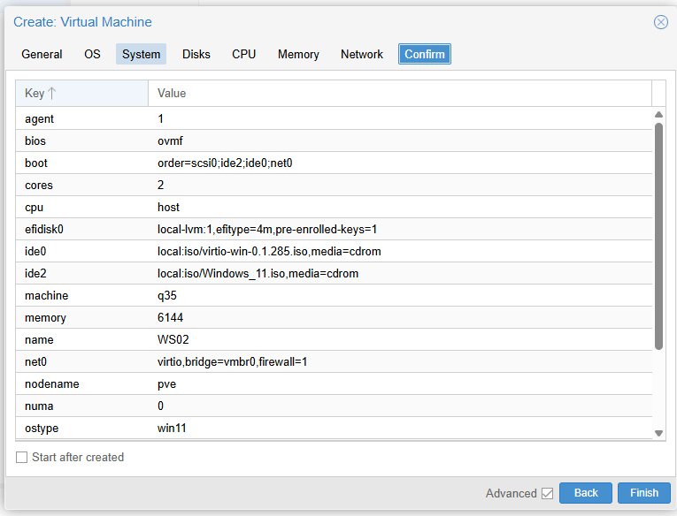
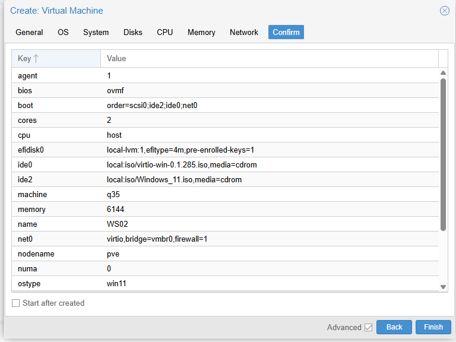
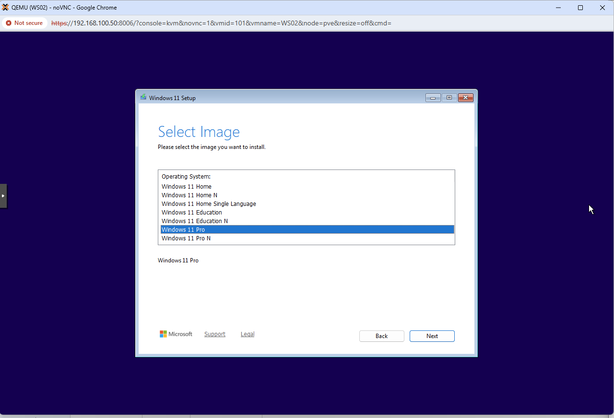

- **Edition:** Windows 11 **Pro**. Home editions cannot join a domain.
- **Disk driver:** loaded `vioscsi\w11\amd64` from the VirtIO ISO (Lab 01 used `2k22`; each OS has its own driver folder).
- **Network during OOBE:** Windows 11 requires a network connection during setup, so the `NetKVM\w11\amd64` driver was installed from the network screen.
- **Device name:** set to `WS02` during setup.
- **Local account:** created `localadmin` through *Set up for work or school → Sign-in options → Domain join instead*. This option creates a local account; the actual domain join happens later.
- After first login, ran `virtio-win-guest-tools.exe` to install the remaining VirtIO drivers and the QEMU Guest Agent.

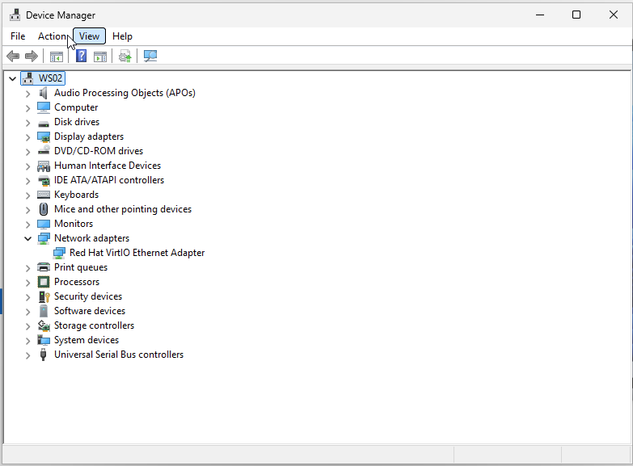

#### 9. Point WS02's DNS to the domain controller

WS02 received its IP and DNS (`192.168.100.1`) from the router. The router does not know `homelab.local`, so a domain join would fail with *"An Active Directory Domain Controller for the domain could not be contacted"*. The IP stays on DHCP; only the DNS server was set manually to DC01.

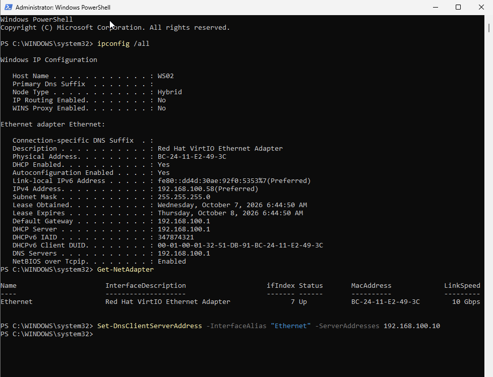

Verification from the client:

- `nslookup homelab.local` → `192.168.100.10`
- SRV record `_ldap._tcp.dc._msdcs.homelab.local` → `dc01.homelab.local`, port 389
- `ping dc01.homelab.local` → 4/4 replies, <1 ms
- `nslookup google.com` → resolved as a *non-authoritative answer*, which confirms the forwarder works

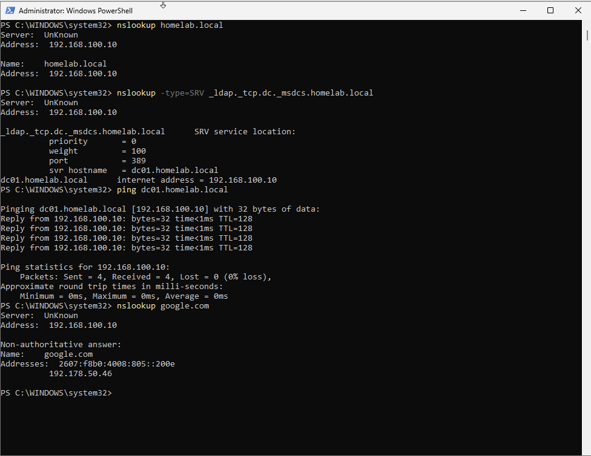

#### 10. Join WS02 to the domain

Joined through `sysdm.cpl` → *Change* → Domain `homelab.local`, using domain administrator credentials.

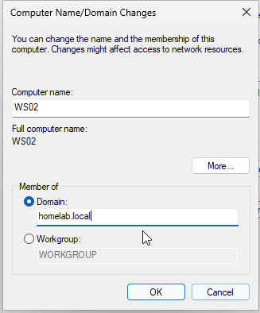
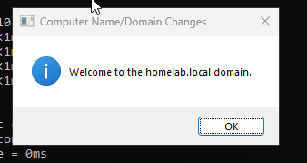

After the restart, the WS02 computer object appeared directly in the **Workstations** OU, confirming the `redircmp` change.

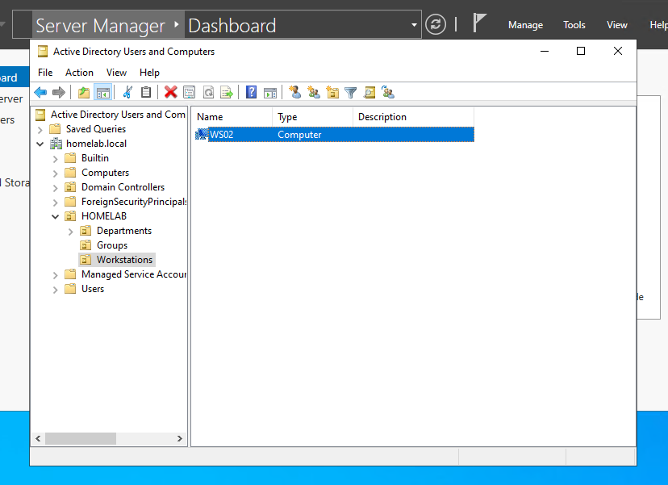

#### 11. Sign in as a domain user

Signed in on WS02 as `HOMELAB\amora`. Windows enforced the password change at first logon, then created her profile.

---

## Verification

| Test | Where | Result |
|---|---|---|
| Computer object location | DC01, ADUC | WS02 in `HOMELAB/Workstations` |
| Session identity | WS02, `whoami` | `homelab\amora` |
| Group membership in the session | WS02, `whoami /groups` | `HOMELAB\GG-IT` |
| Authenticating DC | WS02, `$env:LOGONSERVER` | `\\DC01` |
| First-logon password change | DC01, `Get-ADUser amora -Properties PasswordLastSet` | `PasswordLastSet` = time of the first logon on WS02, `PasswordExpired` = False |

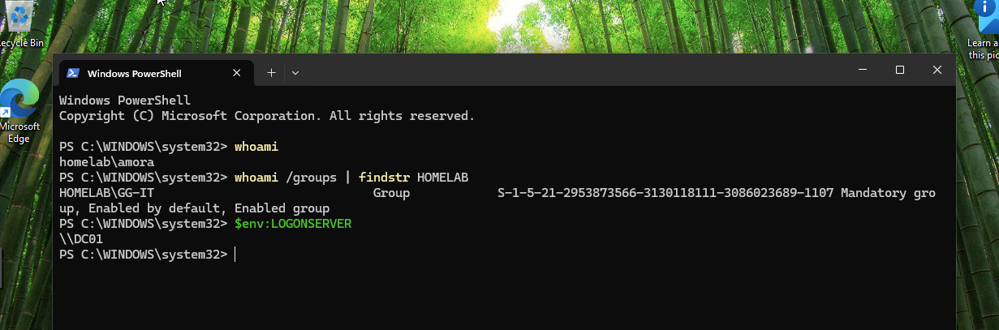
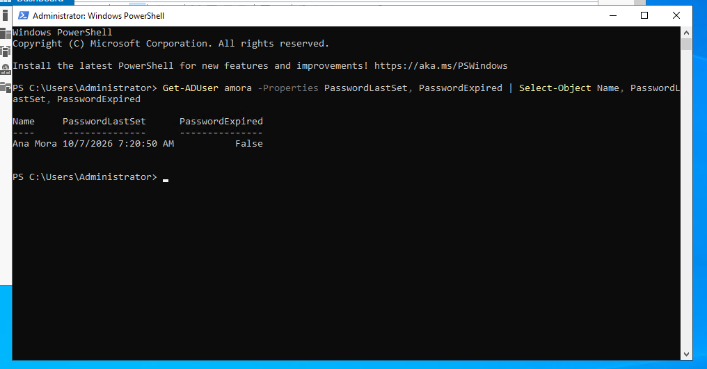

---

## Troubleshooting: VirtualBox on a host with Memory Integrity

**Symptom.** A Windows 11 VM in VirtualBox 7.2 on the MSI (Windows 11 Home) stayed on a black screen for several minutes.

**Diagnosis.**

1. *Session Information* showed **VM Execution Engine: native API**, with Nested Paging and Unrestricted Execution inactive.
2. The VM log identified the cause and its effect:
   - `Core Isolation (Memory Integrity): ENABLED`
   - `HM: HMR3Init: Attempting fall back to NEM: VT-x is not available`
   - `NEM: NEMR3Init: Snail execution mode is active!`
3. The log also showed the firmware stopping at `PciHostBridgeDxe.efi`, identically on two boots. The VM never reached the *"Press any key to boot from CD"* prompt.
4. **Counter-example check:** an Ubuntu VM on the same host also ran on the native API, but booted fine.
5. A Windows 10 VM, which VirtualBox creates with legacy BIOS (no UEFI, no TPM), reached Windows Setup.

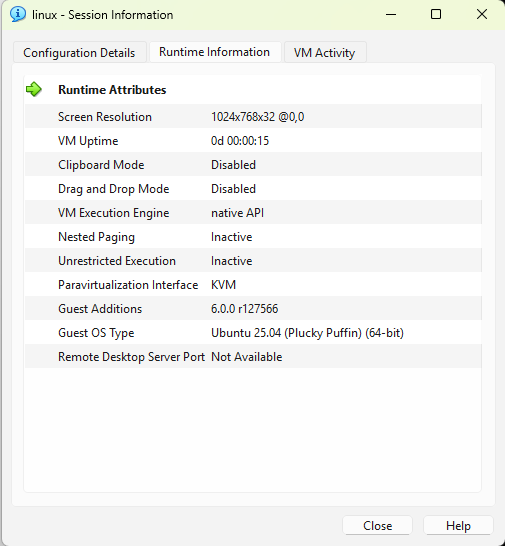
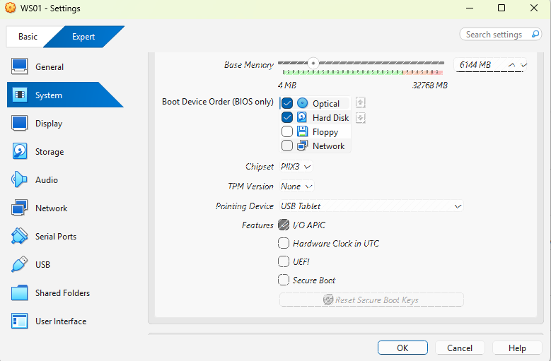
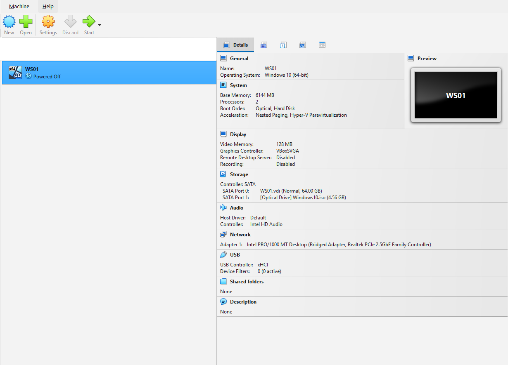
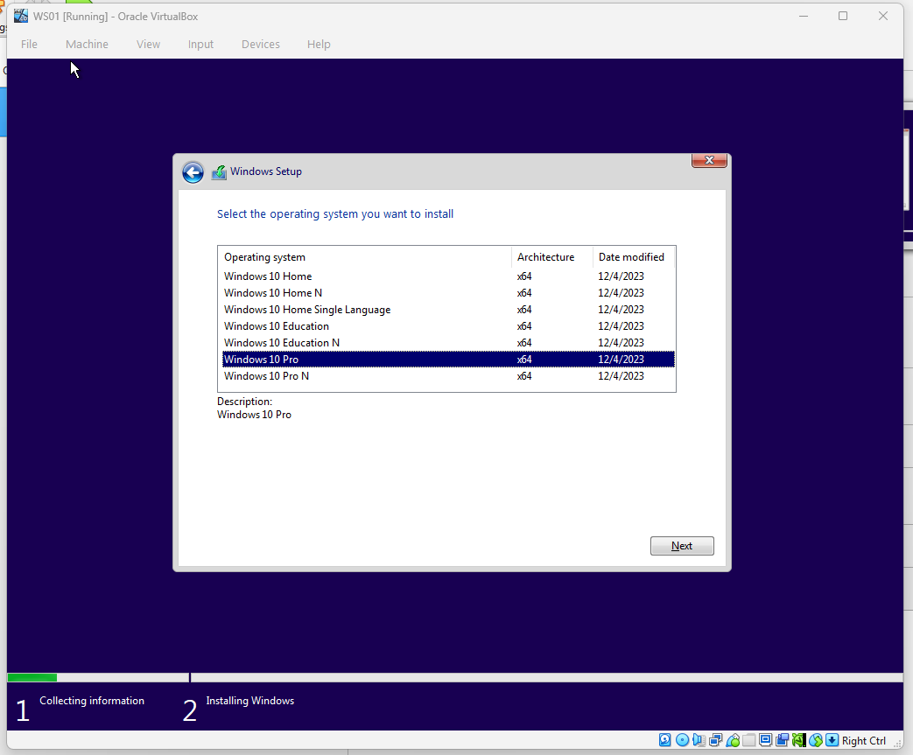

6. The Windows 10 installation then advanced far slower than WS02 on Proxmox, which went from 0% to 82% while WS01 moved from 87% to 88%.
7. After two hours stuck at 90%, *VM Activity* showed **Guest Load 0%**, **disk read/write 0 B/s**, and **VMM Load 49%**: the guest was idle while the virtualization layer consumed the CPU. The installation was hung, not slow.

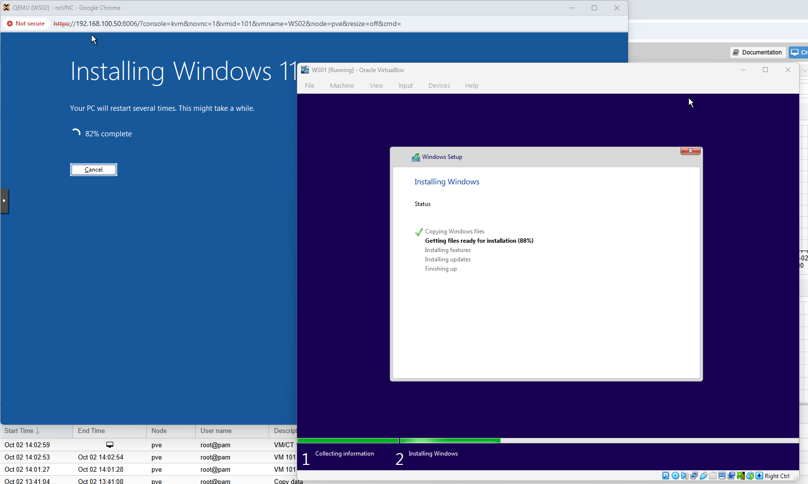
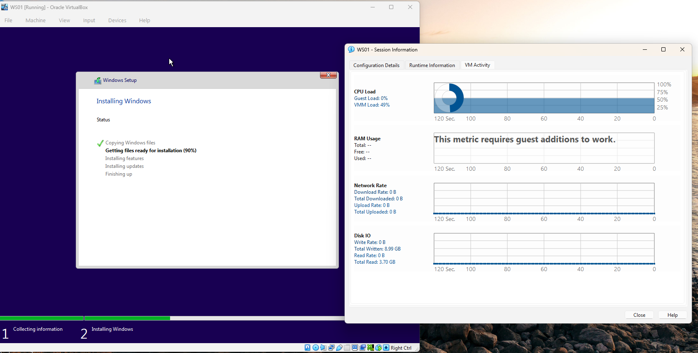

**Root cause.** Memory Integrity (HVCI) is part of Virtualization-Based Security and runs Hyper-V underneath Windows. Only one hypervisor can own VT-x, so VirtualBox falls back to the Windows Hypervisor Platform API (NEM). In that mode, legacy BIOS guests run slowly but work, while the UEFI + TPM boot path required by Windows 11 hangs during firmware initialization, and heavy workloads can stall.

A secondary issue found along the way: the first VirtualBox VM was created with the generic *Other Windows* profile, which applied legacy hardware (IDE controller, AC97 audio) and triggered a misleading graphics-controller warning. Recreating it with the *Windows 11 (64-bit)* profile fixed that, but not the hypervisor problem.

**Decision.** Instead of disabling Memory Integrity, which would weaken the security of my main computer, I moved the client to Proxmox, a type 1 hypervisor with direct access to VT-x. The MSI became the admin workstation. Testing VMware Workstation, which has a more mature Windows Hypervisor Platform integration, is left as a separate experiment.

---

## What I learned

- **Containers vs. OUs.** Default `Users` and `Computers` cannot receive GPOs; real environments move objects into OUs.
- **OUs vs. groups.** OUs organize where objects live; security groups define access. One user lives in one OU but can belong to many groups.
- **Distinguished Names.** `CN=Ana Mora,OU=IT,OU=Departments,OU=HOMELAB,DC=homelab,DC=local` is read from the object up to the domain. `DC=` components map to the DNS name; OUs are not subdomains.
- **Secure scripting.** Read passwords with `-AsSecureString`, and remember that `New-ADUser` creates disabled accounts unless `-Enabled $true` is set.
- **Clients must use the DC for DNS.** The domain join depends on the DC locator SRV record, which only the domain's DNS has. Forwarders keep internet resolution working.
- **`redircmp`** puts new computers in an OU that can receive Group Policy.
- **Windows edition matters.** Home editions cannot join a domain.
- **In-band vs. out-of-band management.** RDP depends on the guest's network and OS; the hypervisor console does not.
- **Modules are per machine.** `Get-ADUser` failed on WS02 because the AD PowerShell module (part of RSAT) is not installed there; the same command worked on DC01.
- **Record temporary passwords.** I lost the shared temporary password of the users created in PowerShell. Resetting it is the first ticket in Lab 03.
- **Troubleshoot with evidence.** A frozen progress bar does not tell whether a process is slow or hung; CPU and disk activity do. Logs, runtime information and controlled comparisons led to the real root cause.
- **Type 1 vs. type 2 hypervisors.** Only one hypervisor can own the CPU's virtualization extensions, which is why Windows security features that use Hyper-V affect VirtualBox.

---

## Commands reference

The full set of commands, grouped by the machine where each one runs, is in [`scripts/lab02-commands.ps1`](scripts/lab02-commands.ps1). Rows marked *GUI equivalent* describe steps I performed in the GUI; the command is the PowerShell way to do the same thing.

| Purpose | Command |
|---|---|
| Create an OU (*GUI equivalent*) | `New-ADOrganizationalUnit -Name "IT" -Path "OU=Departments,OU=HOMELAB,DC=homelab,DC=local"` |
| Read a password securely | `$pass = Read-Host "Temporary password" -AsSecureString` |
| Create a user | `New-ADUser -Name "Carlos Rojas" -GivenName "Carlos" -Surname "Rojas" -SamAccountName "crojas" -UserPrincipalName "crojas@homelab.local" -Department "Sales" -Path "OU=Sales,$ou" -AccountPassword $pass -Enabled $true -ChangePasswordAtLogon $true` |
| Set a user attribute | `Set-ADUser amora -Department "IT"` |
| List users with their department | `Get-ADUser -Filter * -SearchBase $ou -Properties Department \| Select-Object Name, SamAccountName, Department, Enabled` |
| Create a security group | `New-ADGroup -Name "GG-IT" -GroupScope Global -GroupCategory Security -Path $groups -Description "All IT department users"` |
| Add group members | `Add-ADGroupMember -Identity "GG-Sales" -Members crojas, lvargas` |
| Add a DNS forwarder | `Add-DnsServerForwarder -IPAddress 192.168.100.1 -PassThru` |
| Check existing forwarders | `Get-DnsServerForwarder` |
| Test external name resolution | `Resolve-DnsName google.com` |
| Redirect new computers to an OU | `redircmp "OU=Workstations,OU=HOMELAB,DC=homelab,DC=local"` |
| List network adapters | `Get-NetAdapter` |
| Set the client's DNS server | `Set-DnsClientServerAddress -InterfaceAlias "Ethernet" -ServerAddresses 192.168.100.10` |
| Verify the DC locator record | `nslookup -type=SRV _ldap._tcp.dc._msdcs.homelab.local` |
| Join the domain (*GUI equivalent*) | `Add-Computer -DomainName "homelab.local" -Credential "HOMELAB\Administrator" -Restart` |
| Show the signed-in identity | `whoami` |
| Show domain groups in the session | `whoami /groups \| findstr HOMELAB` |
| Show the authenticating DC | `$env:LOGONSERVER` |
| Check when a password was last set | `Get-ADUser amora -Properties PasswordLastSet, PasswordExpired \| Select-Object Name, PasswordLastSet, PasswordExpired` |
