# Lab 03 — Help Desk Tickets: Password Reset, Account Lockout, Offboarding and Onboarding

## Objective

Work four common Service Desk tickets end to end in the `homelab.local` domain, following the same flow for each one: **receive → verify → act → confirm with the user**.

| # | Ticket | User |
|---|---|---|
| 1 | Forgotten password | Carlos Rojas (Sales) |
| 2 | Account locked out | Laura Vargas (Sales) |
| 3 | Offboarding: employee leaves the company | Sofia Jimenez (HR) |
| 4 | Onboarding: replacement hire | Mariana Solano (HR) |

Ticket #1 was not staged: the temporary password set in [Lab 02](../Lab02-Domain-Structure/) had been lost, so the reset was a real need.

---

## Environment / Topology

Same environment as [Lab 02](../Lab02-Domain-Structure/):

| Component | Role |
|---|---|
| DC01 (`192.168.100.10`) | Windows Server 2022 domain controller for `homelab.local`, on Proxmox. Administered over RDP from the MSI desktop. |
| WS02 | Domain-joined Windows 11 Pro client, on Proxmox. Used to reproduce each ticket from the user's side. |

Starting OU structure: `HOMELAB` → `Departments` (`IT`, `Sales`, `HR`), `Groups`, `Workstations`. This lab adds `HOMELAB/Disabled Users`.

---

## Steps

### Ticket #1 — Forgotten password (Carlos Rojas)

> *"I've never been able to sign in because I don't have my password."*

**Verify.** Before resetting anything, I checked the account state, because the fix depends on it (a disabled or locked account needs a different action).

| Attribute | Value | Meaning |
|---|---|---|
| Enabled | True | Account is active |
| LockedOut | False | No unlock needed |
| PasswordLastSet | *(empty)* | Expected: the account was created with *change password at next logon* |
| LastLogonDate | *(empty)* | The user has never signed in, consistent with the ticket |
| BadLogonCount | 1 | One earlier failed attempt |

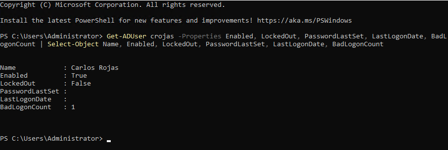

**Act.** Reset the password in ADUC with **User must change password at next logon**, so IT never knows the user's final password. The dialog also showed *Account Lockout Status: Unlocked*.

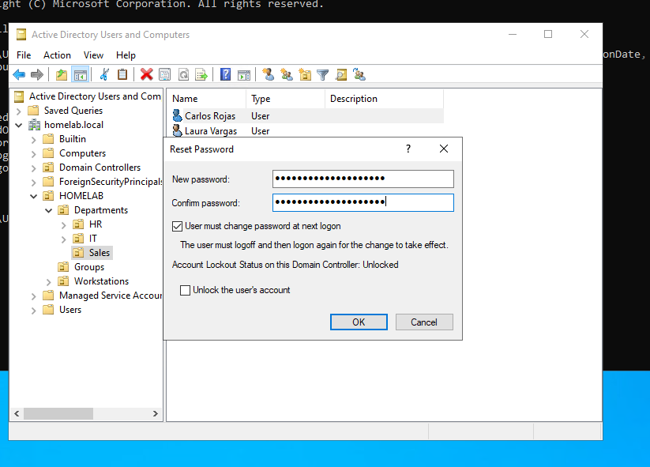

> In production, the caller's identity must be verified before any password reset. This is the main defense against social engineering. In the lab it was assumed.

**Confirm with the user.** Signed in on WS02 as `HOMELAB\crojas`. Windows required a password change before signing in, then the session showed `homelab\crojas` with `HOMELAB\GG-Sales`.

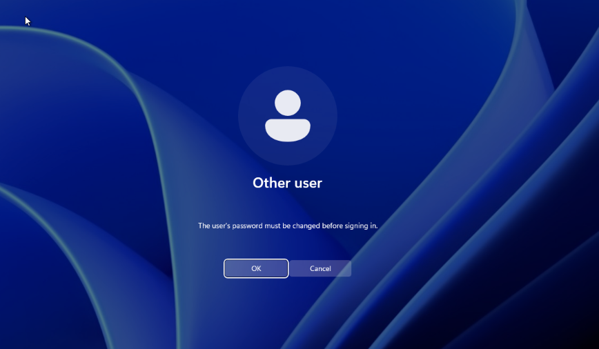
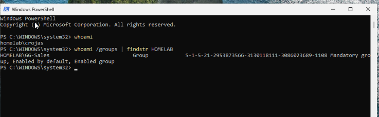

After the fix, `PasswordLastSet` and `LastLogonDate` showed the time of the sign-in and `BadLogonCount` was back to 0.

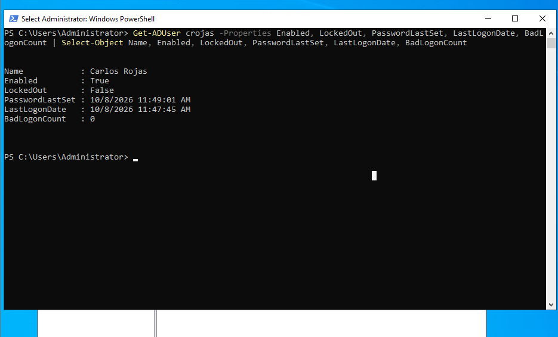

### Ticket #2 — Account locked out (Laura Vargas)

**Prerequisite: account lockout policy.** The domain had `LockoutThreshold = 0`, meaning accounts never lock and passwords can be guessed without limit.

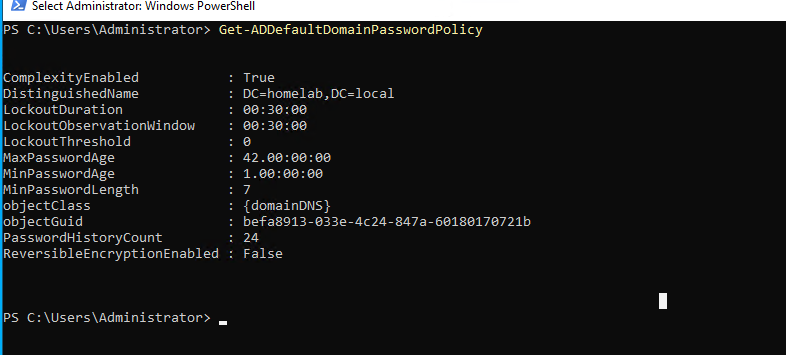

I configured the lockout policy in the **Default Domain Policy** GPO (*Computer Configuration → Policies → Windows Settings → Security Settings → Account Policies → Account Lockout Policy*):

| Setting | Value |
|---|---|
| Account lockout threshold | 5 invalid logon attempts |
| Account lockout duration | 15 minutes |
| Reset account lockout counter after | 15 minutes |

The domain password and lockout policy comes from the GPO linked at the domain root. Setting it there, instead of changing the domain attributes directly, prevents the GPO from overwriting the values on the next refresh. After `gpupdate /force`, `Get-ADDefaultDomainPasswordPolicy` showed `LockoutThreshold = 5`, confirming that the GPO was applied.

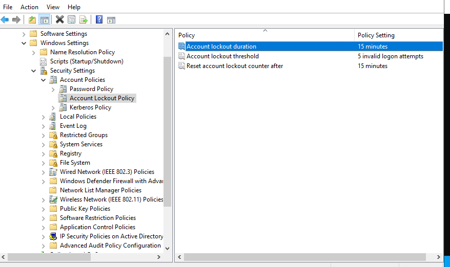
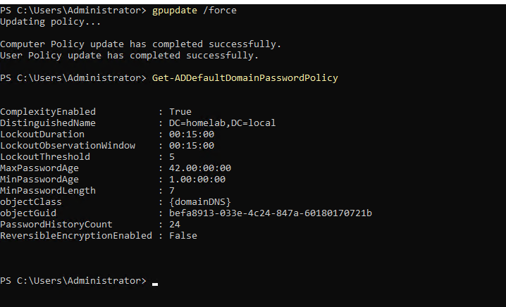

**Reproduce.** On WS02, I entered a wrong password for `HOMELAB\lvargas` five times. Windows 11 first delayed new attempts on the sign-in screen (a local throttling control, separate from the domain lockout); the next attempt showed the domain lockout message.

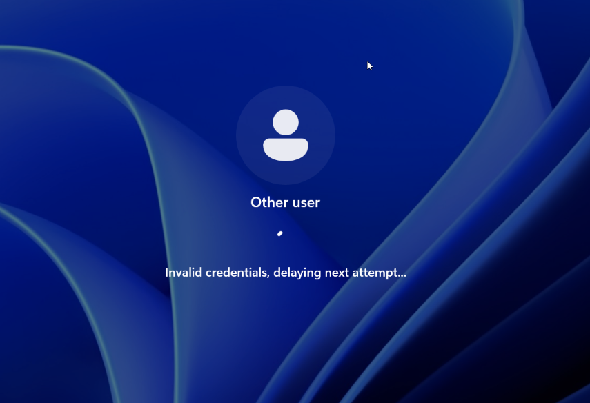
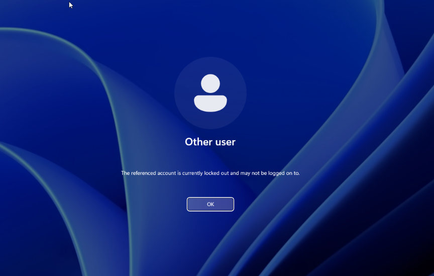

> *"Laura Vargas from Sales: it says my account is locked."*

**Verify.** `Search-ADAccount -LockedOut` lists every locked account in the domain, and `Get-ADUser` showed the details:

| Attribute | Value |
|---|---|
| LockedOut | True |
| BadLogonCount | 5 |
| AccountLockoutTime | 10/8/2026 12:21:41 PM |
| LastBadPasswordAttempt | 10/8/2026 12:21:41 PM |

The lockout time matches the fifth failed attempt to the second.

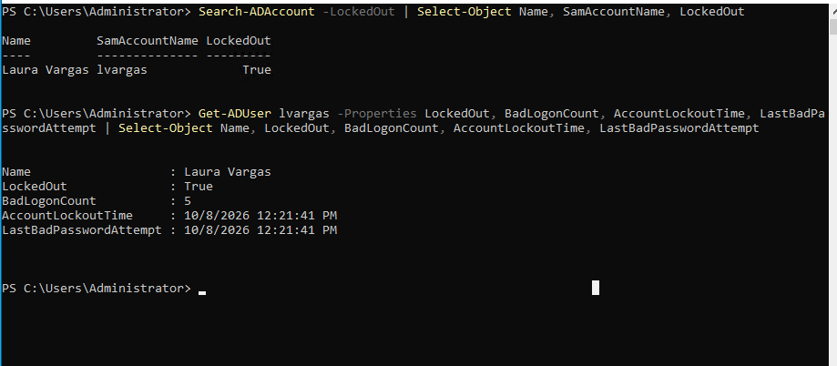

**Act.** The lockout happened because the user did not know her password, so unlocking alone would only lead to another lockout. I reset the password and unlocked the account in the same dialog, which now showed *Account Lockout Status: Locked out*.

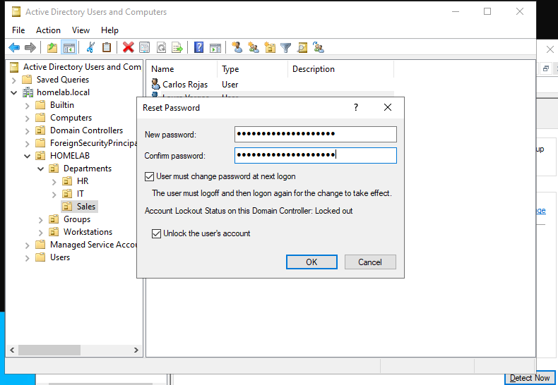
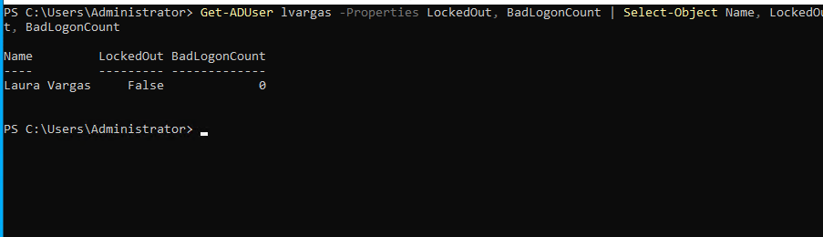

**Confirm with the user.** Laura signed in on WS02, changed her password, and the session showed `homelab\lvargas` with `HOMELAB\GG-Sales`.

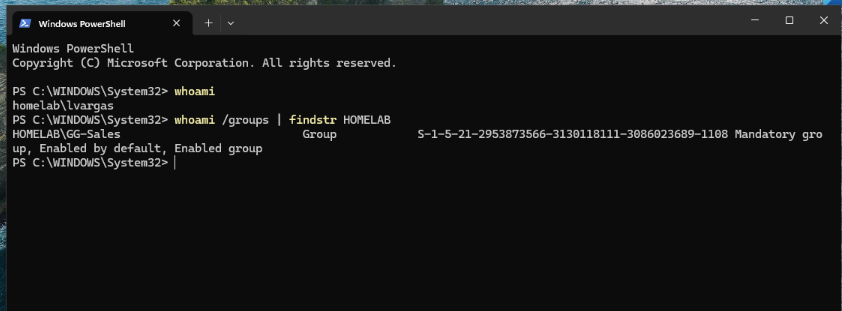

### Ticket #3 — Offboarding (Sofia Jimenez)

> *HR: "Sofia Jimenez leaves the company today. Please remove all her access."*

The account is **disabled, not deleted**. Deleting it would permanently lose its SID: a recreated account would not get back permissions or file ownership, audit records would point to a deleted object, and the change could not be undone. Accounts are deleted only after a retention period.

**Document the current state first.** Group memberships disappear from AD once removed, so I recorded them before making changes: enabled, department HR, member of `GG-HR`, located in the HR OU.

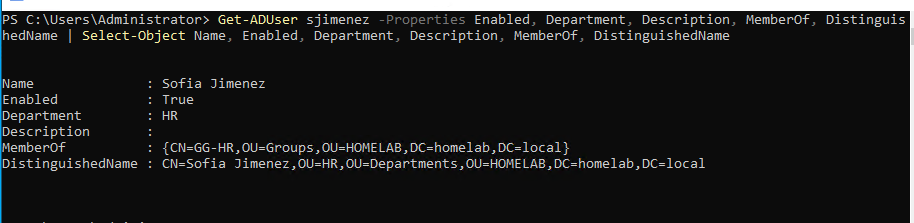

Created the `HOMELAB/Disabled Users` OU to keep inactive accounts separate from active ones and out of departmental GPOs.

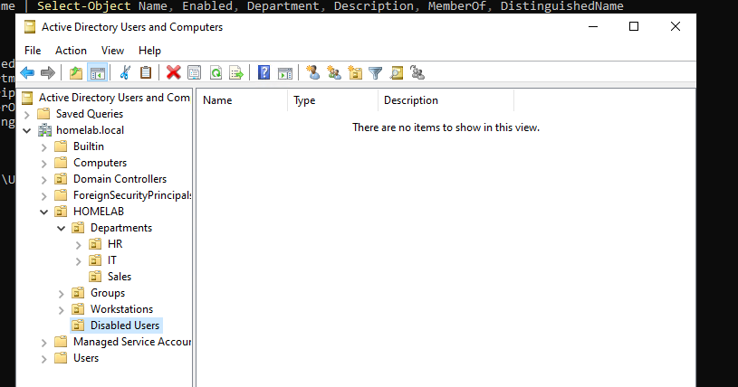

**Act**, in this order:

1. **Disable the account**, which cuts access immediately.
2. **Reset the password to a random value** that is never displayed, so the account cannot be used if it is re-enabled by mistake.
3. **Write a description** with the date, ticket and former groups.
4. **Remove all group memberships** using a loop over `MemberOf`, so the same command works for any number of groups. `Domain Users` remains because it is the primary group.
5. **Move the account** to `Disabled Users`.

Two commands were re-run after typos in parameter names; PowerShell rejected them before execution, so no partial changes were made.

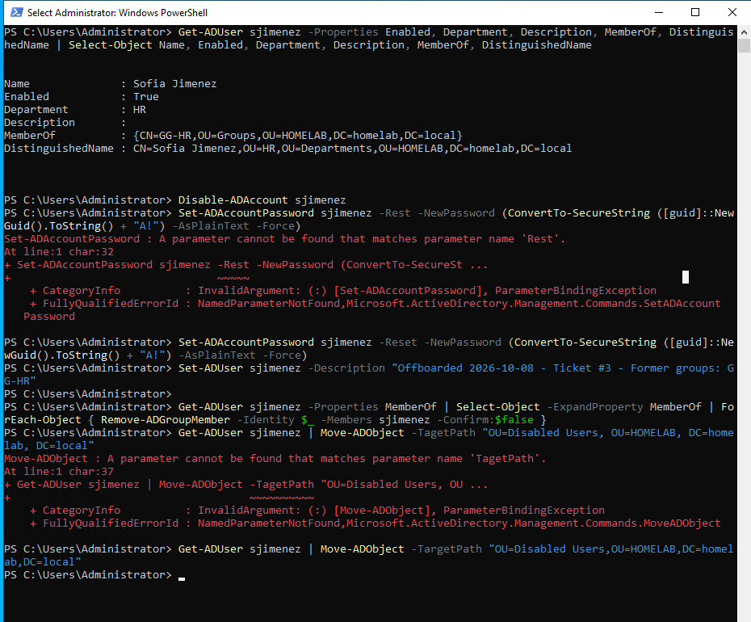

**Verify.**

| Attribute | Before | After |
|---|---|---|
| Enabled | True | False |
| Description | *(empty)* | Offboarded 2026-10-08 - Ticket #3 - Former groups: GG-HR |
| MemberOf | GG-HR | *(empty)* |
| Location | `OU=HR,OU=Departments` | `OU=Disabled Users` |

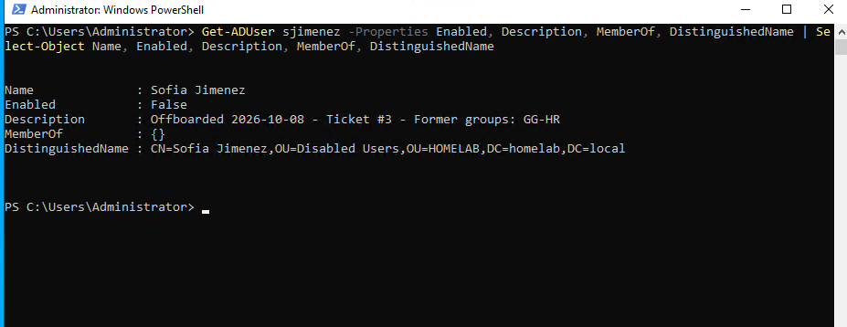
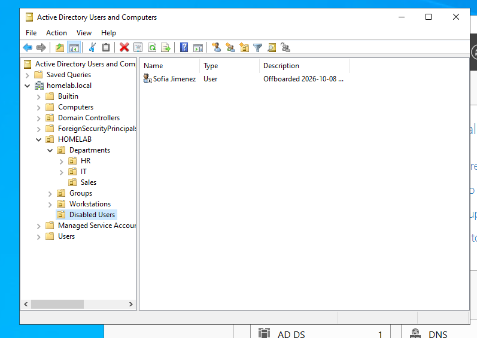

From the user's side, a sign-in attempt as `HOMELAB\sjimenez` on WS02 returned *"Your account has been disabled. Please see your system administrator."*

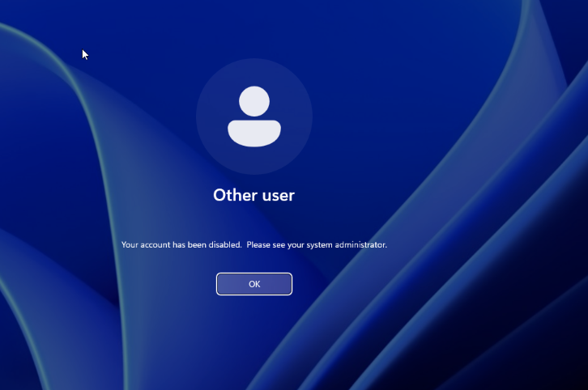

### Ticket #4 — Onboarding (Mariana Solano)

> *HR: "Mariana Solano starts tomorrow as HR Assistant, replacing Sofia Jimenez. Please create her account with HR access."*

Access is assigned **by role**, not by copying the previous employee's account. Copying accounts carries over permissions that may no longer apply (privilege creep).

**Act.**

1. Confirmed the logon name was available with `Get-ADUser -Filter`, which returns nothing instead of an error when no match exists.
2. Created the account in the HR OU with the naming convention, title, department, a description recording the ticket, a temporary password read as a `SecureString`, and *change password at next logon*.
3. Added the user to `GG-HR`, the role group.

| Attribute | Value |
|---|---|
| Title | HR Assistant |
| Department | HR |
| Description | Onboarded 2026-10-08 - Ticket #4 - Replaces sjimenez |
| Enabled | True |
| MemberOf | GG-HR |
| Location | `OU=HR,OU=Departments,OU=HOMELAB` |

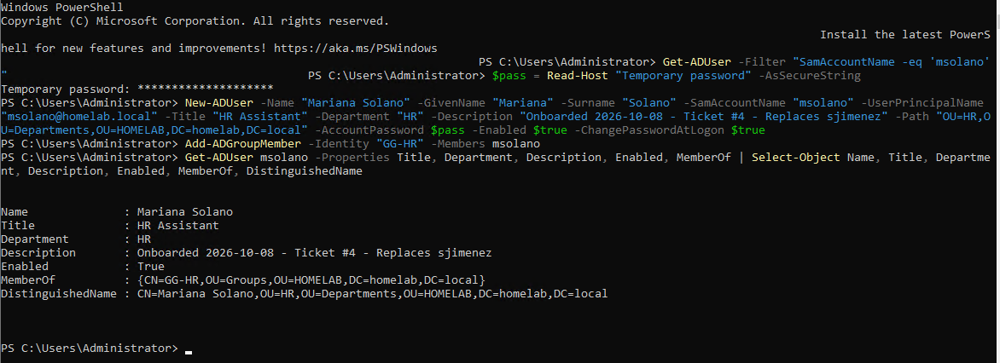

**Confirm with the user.** Mariana signed in on WS02, changed her temporary password, and the session showed `homelab\msolano` with `HOMELAB\GG-HR`.

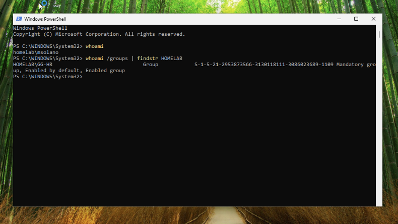

---

## Verification

| Ticket | Check | Result |
|---|---|---|
| #1 Password reset | Sign-in on WS02 + `Get-ADUser crojas` | Forced password change at logon; `PasswordLastSet` and `LastLogonDate` updated; `BadLogonCount` 0 |
| #2 Lockout policy | `Get-ADDefaultDomainPasswordPolicy` | `LockoutThreshold` 0 → 5, duration and window 15 minutes |
| #2 Lockout | `Search-ADAccount -LockedOut` | Laura listed as locked; lockout time equal to the fifth bad attempt |
| #2 Unlock | `Get-ADUser lvargas` + sign-in on WS02 | `LockedOut` False, `BadLogonCount` 0, user signed in |
| #3 Offboarding | `Get-ADUser sjimenez` + sign-in attempt on WS02 | Disabled, no group memberships, in `Disabled Users`, sign-in refused |
| #4 Onboarding | `Get-ADUser msolano` + sign-in on WS02 | Correct OU, attributes and `GG-HR` membership; user signed in |

---

## What I learned

- **Verify before acting.** Checking `Enabled`, `LockedOut` and `BadLogonCount` first tells you whether the ticket needs a reset, an unlock, both, or something else.
- **A ticket closes when the user confirms it works**, not when the admin clicks OK.
- **Forced password change** at next logon keeps the final password known only to the user.
- **Identity verification** before a password reset is the main defense against social engineering.
- **An empty `PasswordLastSet`** means the account is flagged to change its password at next logon.
- **`LastLogonDate` is approximate.** It comes from `lastLogonTimestamp`, which replicates with a deliberate delay of up to about 14 days. It is useful to find inactive accounts, not exact sign-in times.
- **Lockout policy is a balance.** Too low generates tickets from typos; zero allows unlimited password guessing.
- **The domain password and lockout policy lives in the Default Domain Policy GPO**, and `gpupdate /force` plus a query confirms it was applied.
- **Two layers against password guessing:** Windows 11 delays attempts on the sign-in screen, and the domain locks the account.
- **Find the cause of a lockout.** A user who forgot the password needs a reset as well as an unlock. Repeated lockouts with no user error usually come from a device still using an old password; event ID 4740 on the DC records the source computer.
- **Disable, don't delete.** Keeping the account preserves its SID, audit trail and reversibility during a retention period.
- **Document before removing access**, and leave the reason in the account's description.
- **Assign access by role** to avoid privilege creep.
- **Write commands generically** (`ForEach-Object` over `MemberOf`) so they work for any user.
- **`Get-ADUser -Filter`** returns nothing instead of an error when a user does not exist, which makes it the right tool to check whether a name is available.
- **PowerShell basics:** Verb-Noun command names, `-Properties` to request attributes beyond the default set, and the pipeline passing objects, not text.

---

## Commands reference

The full set of commands is in [`scripts/lab03-commands.ps1`](scripts/lab03-commands.ps1). Rows marked *GUI equivalent* describe steps I performed in ADUC or GPMC.

| Purpose | Command |
|---|---|
| Check an account's state | `Get-ADUser crojas -Properties Enabled, LockedOut, PasswordLastSet, LastLogonDate, BadLogonCount` |
| Reset a password (*GUI equivalent*) | `Set-ADAccountPassword crojas -Reset -NewPassword (Read-Host "New temporary password" -AsSecureString)` |
| Force a password change at next logon (*GUI equivalent*) | `Set-ADUser crojas -ChangePasswordAtLogon $true` |
| Show the domain password and lockout policy | `Get-ADDefaultDomainPasswordPolicy` |
| Apply Group Policy immediately | `gpupdate /force` |
| List locked accounts in the domain | `Search-ADAccount -LockedOut \| Select-Object Name, SamAccountName, LockedOut` |
| Show lockout details | `Get-ADUser lvargas -Properties LockedOut, BadLogonCount, AccountLockoutTime, LastBadPasswordAttempt` |
| Unlock an account (*GUI equivalent*) | `Unlock-ADAccount lvargas` |
| Disable an account | `Disable-ADAccount sjimenez` |
| Set a random password nobody knows | `Set-ADAccountPassword sjimenez -Reset -NewPassword (ConvertTo-SecureString ([guid]::NewGuid().ToString() + "A!") -AsPlainText -Force)` |
| Record the offboarding | `Set-ADUser sjimenez -Description "Offboarded 2026-10-08 - Ticket #3 - Former groups: GG-HR"` |
| Remove all group memberships | `Get-ADUser sjimenez -Properties MemberOf \| Select-Object -ExpandProperty MemberOf \| ForEach-Object { Remove-ADGroupMember -Identity $_ -Members sjimenez -Confirm:$false }` |
| Move an account to another OU | `Get-ADUser sjimenez \| Move-ADObject -TargetPath "OU=Disabled Users,OU=HOMELAB,DC=homelab,DC=local"` |
| Check whether a logon name is available | `Get-ADUser -Filter "SamAccountName -eq 'msolano'"` |
| Create a user with role attributes | `New-ADUser -Name "Mariana Solano" ... -Title "HR Assistant" -Department "HR" -Path "OU=HR,OU=Departments,OU=HOMELAB,DC=homelab,DC=local" -AccountPassword $pass -Enabled $true -ChangePasswordAtLogon $true` |
| Add a user to the role group | `Add-ADGroupMember -Identity "GG-HR" -Members msolano` |
| Confirm identity and groups on the client | `whoami` and `whoami /groups \| findstr HOMELAB` |
