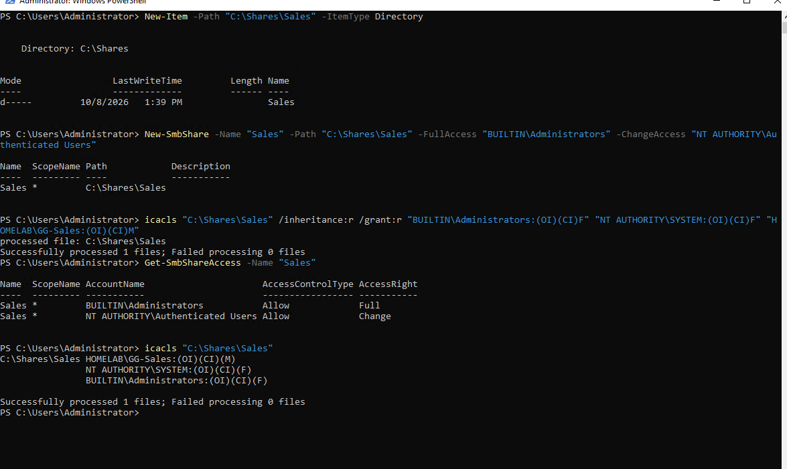
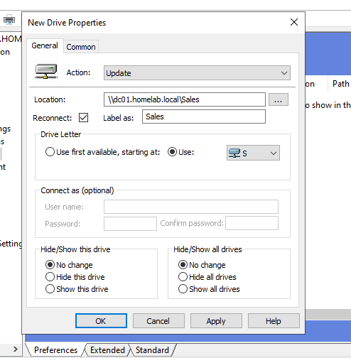
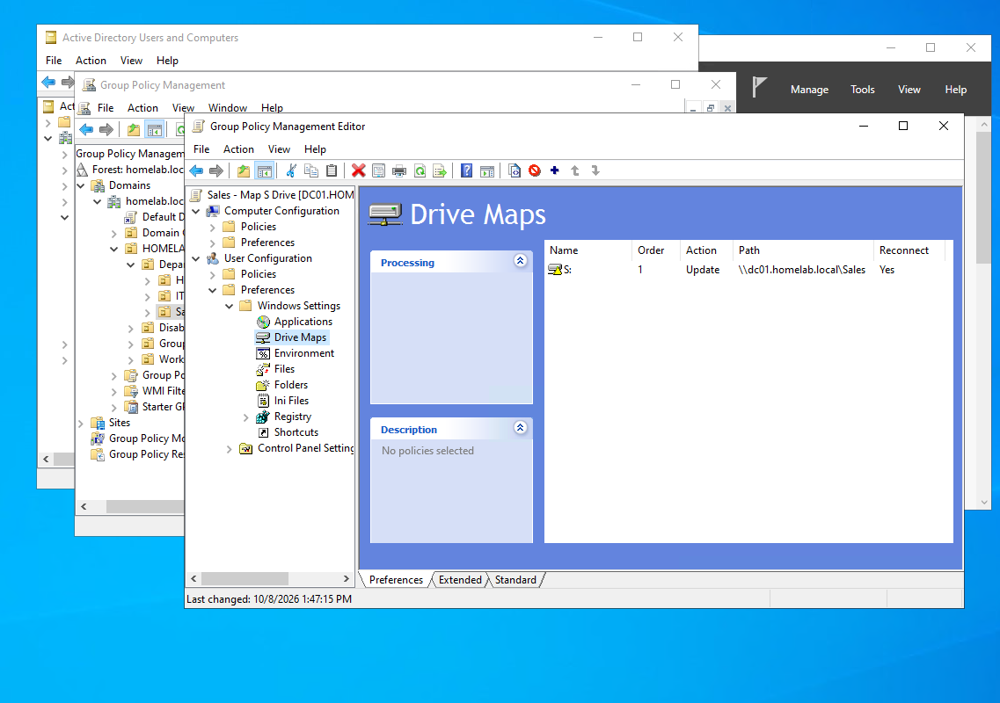
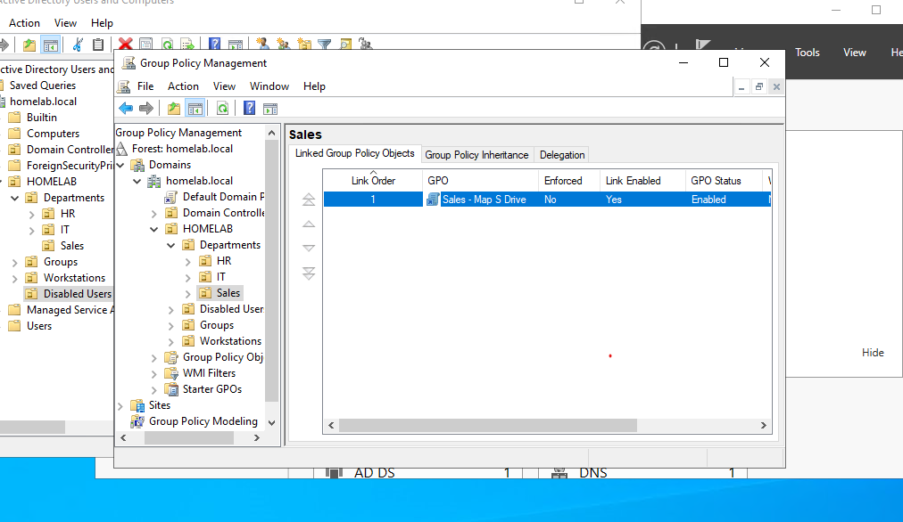
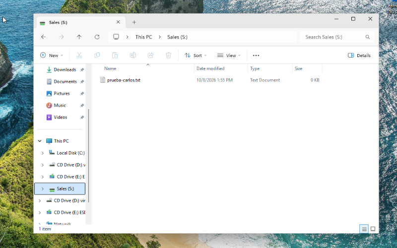
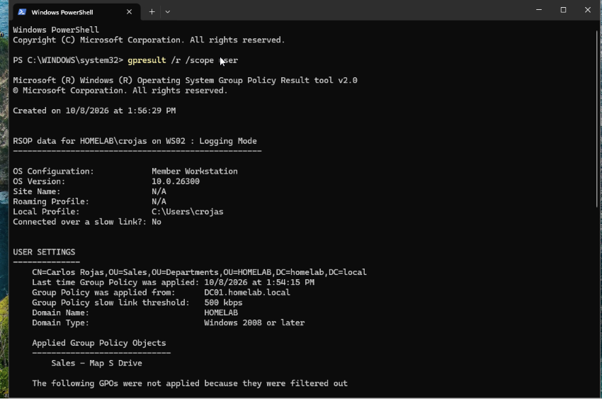
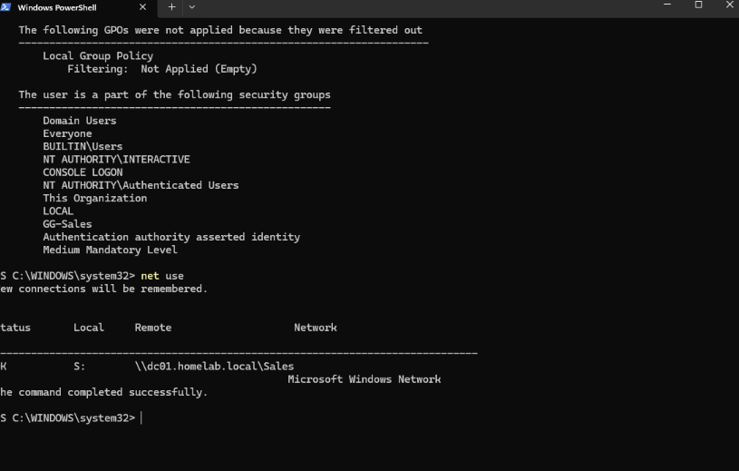
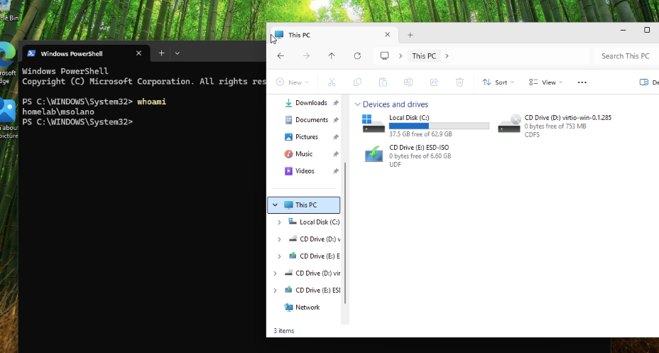
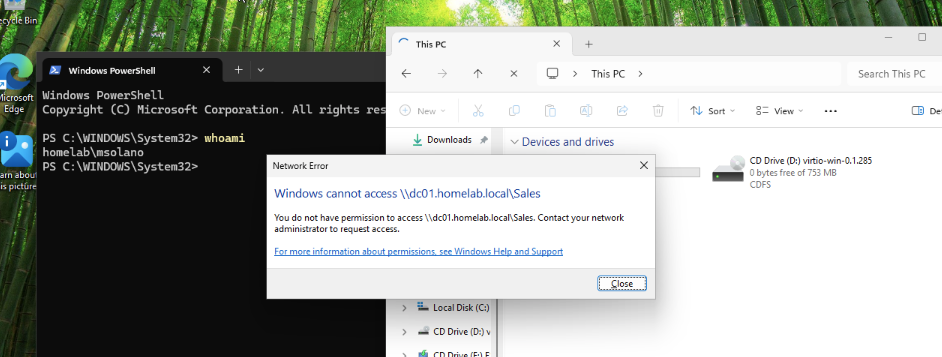

# Lab 04 — Shared Folder with Group-Based Permissions and a GPO-Mapped Drive

## Objective

Give the Sales department a shared folder that only Sales users can access, and map it automatically as drive **S:** for Sales users through Group Policy. Then test it from both sides: a Sales user who should have access and a user from another department who should not.

---

## Environment / Topology

Same environment as [Lab 02](../Lab02-Domain-Structure/) and [Lab 03](../Lab03-Helpdesk-Tickets/):

| Component | Role |
|---|---|
| DC01 (`192.168.100.10`) | Windows Server 2022 domain controller for `homelab.local`. Hosts the `Sales` share in this lab. |
| WS02 | Domain-joined Windows 11 Pro client used for testing. |
| Carlos Rojas (`crojas`) | Sales user, member of `GG-Sales`, in the `Sales` OU |
| Mariana Solano (`msolano`) | HR user, member of `GG-HR`, in the `HR` OU |

> In this lab the share lives on the domain controller for simplicity. In production, file shares belong on a separate file server; a domain controller should not take on that role.

---

## Steps

### 1. Create the folder, the share and the permissions

Access to a network share is controlled by **two layers**:

| Layer | Configured on | Applies |
|---|---|---|
| Share permissions | The SMB share | Only when accessed over the network |
| NTFS permissions | The folder on disk | Always, over the network or locally |

Over the network, both layers apply and **the most restrictive one wins**. The common practice, used here, is to keep share permissions broad and control access with NTFS, so permissions are managed in one place.

| Layer | Principal | Permission |
|---|---|---|
| Share | BUILTIN\Administrators | Full |
| Share | Authenticated Users | Change |
| NTFS | BUILTIN\Administrators | Full control |
| NTFS | SYSTEM | Full control |
| NTFS | HOMELAB\GG-Sales | Modify |

- Inheritance from `C:\` was removed (`icacls /inheritance:r`). Without that, the folder would inherit permissions that let any user read it.
- `GG-Sales` gets **Modify**: read, create, change and delete files, but not change permissions.
- `(OI)(CI)` makes the permissions apply to every file and subfolder created inside.
- Permissions go to the **group**, not to individual users, so access follows group membership.

### 2. Map the drive with a GPO

Created a GPO named **Sales - Map S Drive** and linked it to the `HOMELAB/Departments/Sales` OU, with this drive map under *User Configuration → Preferences → Windows Settings → Drive Maps*:

| Setting | Value |
|---|---|
| Action | Update |
| Location | `\\dc01.homelab.local\Sales` |
| Reconnect | Yes |
| Label | Sales |
| Drive letter | S: |

- **Linked to the Sales OU:** a GPO applies to the objects inside the OU it is linked to, so only Sales users get the drive. This is why users live in OUs rather than in the default `Users` container, where GPOs cannot be linked.
- **User Configuration:** the drive follows the user to any domain computer.
- **Action Update:** creates the drive if it doesn't exist and corrects it if it does, so repeated processing breaks nothing.
- **FQDN path:** avoids depending on short-name resolution.

### 3. Test as a Sales user

Signed in on WS02 as `HOMELAB\crojas` with a new logon, since drive maps apply at sign-in.

- Drive **S:** appeared in File Explorer.
- Created `prueba-carlos.txt` in S:, confirming write access (Modify), not only read.

- `gpresult /r /scope user` showed the user in `OU=Sales`, the GPO **Sales - Map S Drive** applied from `DC01.homelab.local`, and `GG-Sales` among the user's security groups.
- `net use` showed `S:` connected to `\\dc01.homelab.local\Sales`.

### 4. Test as a user from another department

Signed in on WS02 as `HOMELAB\msolano` (HR).

- No S: drive appeared, because the GPO is linked to the Sales OU and Mariana is in the HR OU.

- Typing `\\dc01.homelab.local\Sales` manually in File Explorer returned **"You do not have permission to access \\dc01.homelab.local\Sales"**. The share permissions let her through (Authenticated Users: Change), but NTFS has no entry for her, so access is denied.

This second test is the important one: **security does not depend on the GPO**. Hiding a drive is convenience; the permissions are what block a user who knows the path.

---

## Verification

| Test | User | Expected | Result |
|---|---|---|---|
| Drive mapped at sign-in | crojas (Sales) | S: appears | S: appeared |
| Write access | crojas (Sales) | Can create files | `prueba-carlos.txt` created |
| GPO applied | crojas (Sales) | `gpresult` lists the GPO | *Sales - Map S Drive* applied from DC01 |
| Drive connection | crojas (Sales) | `net use` shows S: | `S:` → `\\dc01.homelab.local\Sales` |
| GPO scope | msolano (HR) | No S: drive | No S: drive |
| Direct access by path | msolano (HR) | Access denied | "You do not have permission to access" |

---

## What I learned

- **Share vs. NTFS permissions.** Over the network both apply and the most restrictive wins. Keeping the share broad and controlling access with NTFS leaves one place to manage permissions.
- **Break inheritance deliberately.** A new folder inherits permissions from its parent; removing them is what keeps other users out.
- **Grant access to groups**, so onboarding and offboarding are a matter of group membership (see [Lab 03](../Lab03-Helpdesk-Tickets/)).
- **GPOs apply by OU link.** The OU structure from Lab 02 is what makes it possible to target one department.
- **Preferences vs. Policies.** Drive maps are a preference that sets up the user's environment; policies enforce settings.
- **A GPO controls what users see, permissions control what they can access.** The HR user could not open the share even with the exact path.
- **`gpresult /r`** shows which GPOs reached a user and which groups they belong to; it is the first check for "my drive isn't showing up".
- **`net use`** lists mapped network drives and where they point.
- **Drive maps apply at sign-in**, so testing needs a fresh logon.
- **File shares belong on a file server**, not on a domain controller, outside a lab.

---

## Commands reference

The full set of commands is in [`scripts/lab04-commands.ps1`](scripts/lab04-commands.ps1). The GPO was created and configured in GPMC.

| Purpose | Command |
|---|---|
| Create the folder | `New-Item -Path "C:\Shares\Sales" -ItemType Directory` |
| Create the share with broad share permissions | `New-SmbShare -Name "Sales" -Path "C:\Shares\Sales" -FullAccess "BUILTIN\Administrators" -ChangeAccess "NT AUTHORITY\Authenticated Users"` |
| Remove inheritance and set NTFS permissions | `icacls "C:\Shares\Sales" /inheritance:r /grant:r "BUILTIN\Administrators:(OI)(CI)F" "NT AUTHORITY\SYSTEM:(OI)(CI)F" "HOMELAB\GG-Sales:(OI)(CI)M"` |
| Show share permissions | `Get-SmbShareAccess -Name "Sales"` |
| Show NTFS permissions | `icacls "C:\Shares\Sales"` |
| Show GPOs applied to the signed-in user | `gpresult /r /scope user` |
| List mapped network drives | `net use` |
| Force a Group Policy refresh | `gpupdate /force` |
