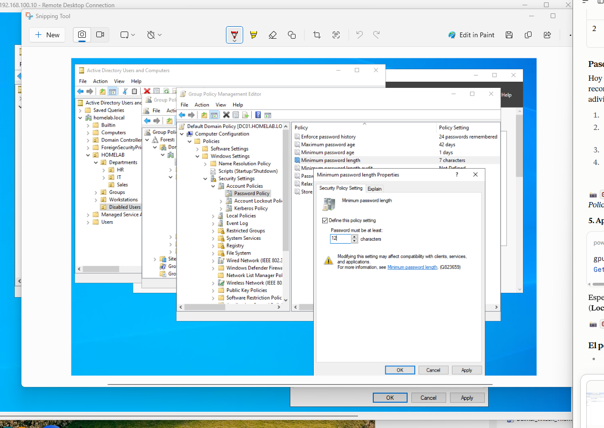
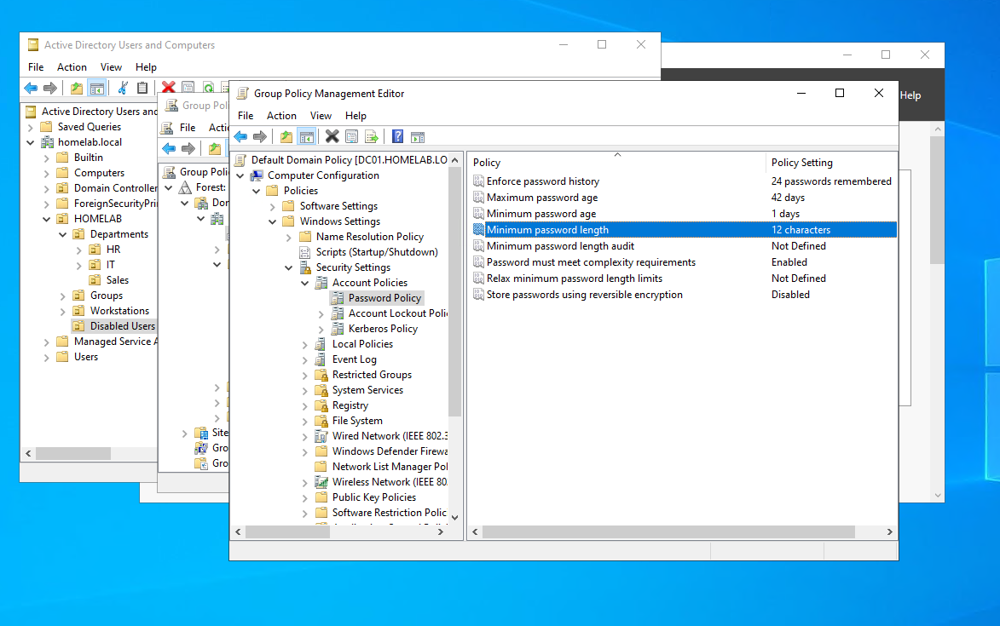
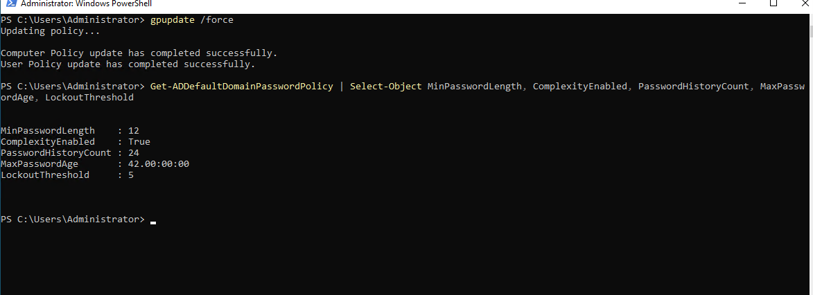
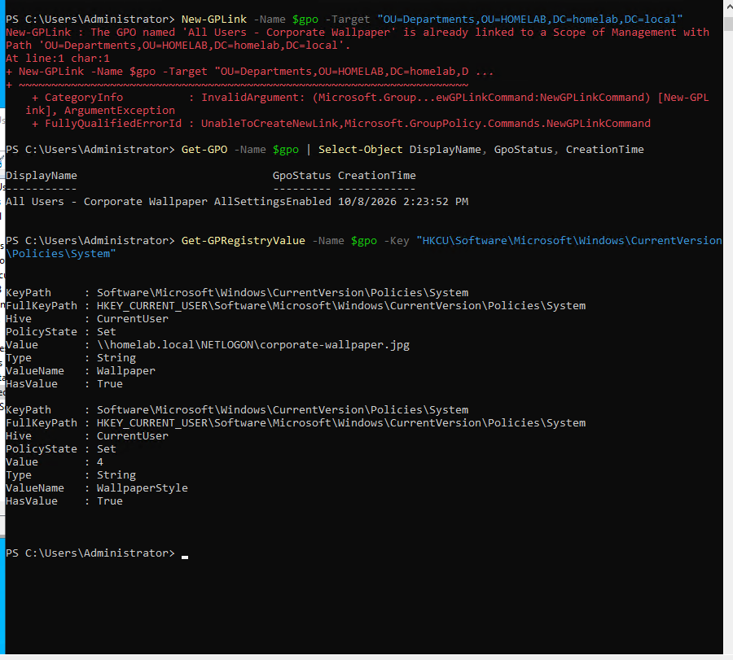
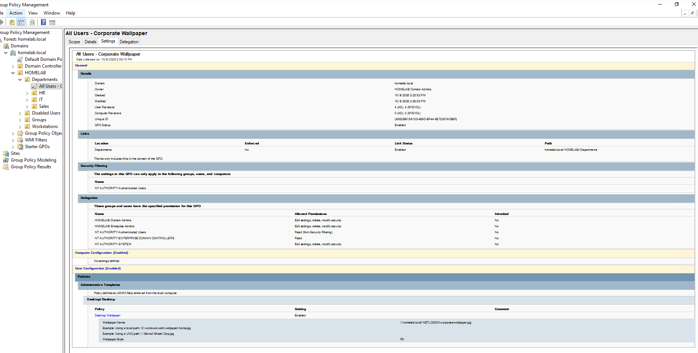
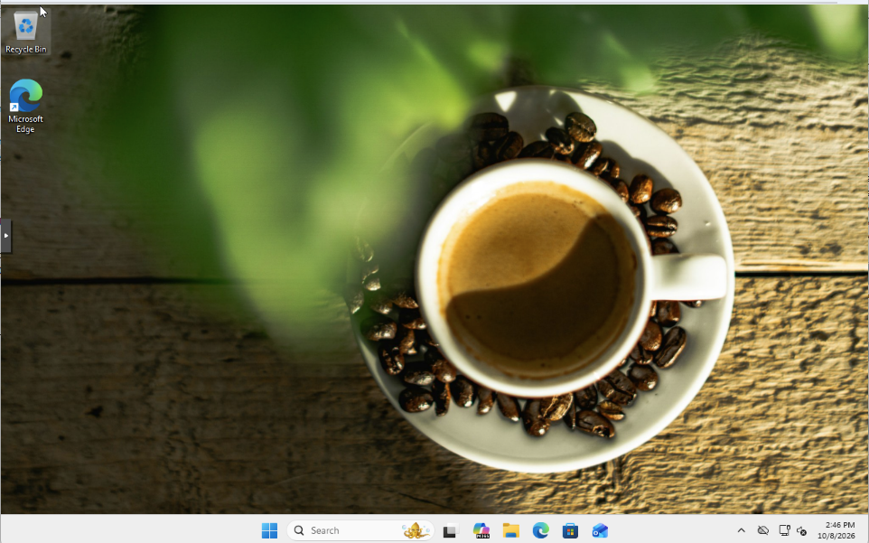
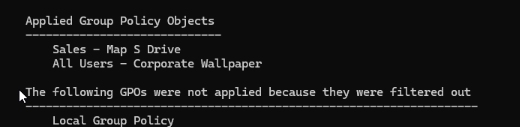
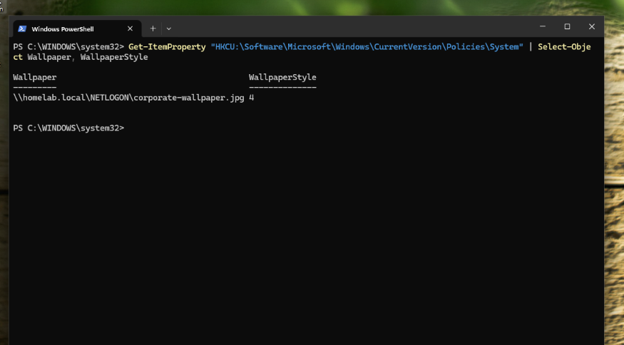

# Lab 05 — Group Policy: Password Policy (GPMC) and Corporate Wallpaper (PowerShell)

## Objective

Configure two useful Group Policy settings in `homelab.local` using two different methods:

| # | Setting | Method |
|---|---|---|
| 1 | Stronger domain password policy (minimum length 12) | GPMC, editing the Default Domain Policy |
| 2 | Corporate wallpaper for every department user | PowerShell only: create, configure and link the GPO without opening GPMC |

Then verify both on the domain controller and on a client.

---

## Environment / Topology

Same environment as the previous labs:

| Component | Role |
|---|---|
| DC01 (`192.168.100.10`) | Windows Server 2022 domain controller for `homelab.local` |
| WS02 | Domain-joined Windows 11 Pro client (not activated) |
| Laura Vargas (`lvargas`) | Test user in `HOMELAB/Departments/Sales` |

GPOs in the domain after this lab:

| GPO | Linked to | Lab |
|---|---|---|
| Default Domain Policy | `homelab.local` (domain root) | Lockout policy in [Lab 03](../Lab03-Helpdesk-Tickets/), password policy in this lab |
| Sales - Map S Drive | `Departments/Sales` | [Lab 04](../Lab04-File-Shares/) |
| All Users - Corporate Wallpaper | `Departments` | This lab |

---

## Steps

### 1. Password policy (GPMC)

The domain allowed 7-character passwords. In the **Default Domain Policy** (*Computer Configuration → Policies → Windows Settings → Security Settings → Account Policies → Password Policy*), I raised **Minimum password length** from 7 to **12** and left the other settings unchanged.

| Setting | Value |
|---|---|
| Enforce password history | 24 passwords remembered |
| Maximum password age | 42 days |
| Minimum password age | 1 day |
| Minimum password length | 12 characters (was 7) |
| Password must meet complexity requirements | Enabled |

- **Why the Default Domain Policy:** the domain password policy only takes effect from a GPO linked at the domain root. A GPO linked to an OU does not change domain account passwords; different policies per group require Fine-Grained Password Policies.
- **Existing passwords are not affected.** The new minimum applies the next time each user changes their password. In production, a change like this is announced in advance because it generates help desk calls as passwords expire.
- The editor warned that the change *"may affect compatibility with clients, services, and applications"*, a reminder to check service accounts and legacy applications before tightening the policy.

After `gpupdate /force`, `Get-ADDefaultDomainPasswordPolicy` showed `MinPasswordLength = 12`, with the Lab 03 lockout policy unchanged (`LockoutThreshold = 5`).

### 2. Corporate wallpaper (PowerShell only)

**Image.** I downloaded a free-license image on my workstation (not on the server: browsing from a domain controller is bad practice, which is also why Internet Explorer Enhanced Security Configuration is on by default) and copied it over RDP to the `NETLOGON` share (`C:\Windows\SYSVOL\sysvol\homelab.local\scripts`).

- `NETLOGON` exists on every domain controller, is readable by all authenticated users and replicates between DCs.
- The path `\\homelab.local\NETLOGON\...` uses the domain name rather than a server name, so it keeps working with more than one DC.

**GPO.** Created with the GroupPolicy PowerShell module:

1. `New-GPO` created **All Users - Corporate Wallpaper**.
2. `Set-GPRegistryValue` wrote the two user registry values that the *Desktop Wallpaper* Administrative Template setting uses, under `HKCU\Software\Microsoft\Windows\CurrentVersion\Policies\System`:
   - `Wallpaper` = `\\homelab.local\NETLOGON\corporate-wallpaper.jpg`
   - `WallpaperStyle` = `4` (Fill)
3. `New-GPLink` linked it to the `Departments` OU, so through **inheritance** it applies to the `IT`, `Sales` and `HR` child OUs. The Administrator account, in the default `Users` container, is not affected.

The GPO had already been created and linked in an earlier run, so re-running the block returned *already exists* and *already linked* errors for `New-GPO` and `New-GPLink`, while `Set-GPRegistryValue` updated the values. The final state was confirmed with `Get-GPO` and `Get-GPRegistryValue`.

**Confirmed in GPMC.** The *Settings* report showed the registry values written by PowerShell as **Desktop Wallpaper: Enabled** under *Administrative Templates → Desktop/Desktop*, with the UNC path and style *Fill*; the link on `Departments`; security filtering on Authenticated Users; and matching user revisions in AD and SYSVOL (4 and 4). Configuring the GPO with PowerShell produced the same result as configuring it in the GUI.

The report renders inside an Internet Explorer component, so IE Enhanced Security Configuration showed a warning. I closed it without adding an exception, and the report still rendered.

### 3. Test on the client

Signed in on WS02 as `HOMELAB\lvargas` (a user in the `Sales` OU, below `Departments`).

`gpresult /r /scope user` listed both user GPOs: **Sales - Map S Drive**, linked to her own OU, and **All Users - Corporate Wallpaper**, inherited from the parent OU.

**Separating two possible causes.** In *Settings → Personalization → Background*, Windows showed *"You need to activate Windows before you can personalize your PC"*. WS02 is not activated, and an unactivated Windows blocks personalization on its own, so that screen could not show whether the GPO was enforcing the wallpaper. I checked the user's registry instead: the policy values were present in Laura's session under the `Policies` branch, which is where Windows reads enforced settings.

---

## Verification

| Check | Where | Result |
|---|---|---|
| Minimum password length | DC01, `Get-ADDefaultDomainPasswordPolicy` | 12 (was 7) |
| Lockout policy unchanged | DC01, `Get-ADDefaultDomainPasswordPolicy` | `LockoutThreshold` 5 |
| Wallpaper image reachable | DC01, `Test-Path \\homelab.local\NETLOGON\corporate-wallpaper.jpg` | True |
| GPO configuration | DC01, `Get-GPRegistryValue` | `Wallpaper` and `WallpaperStyle` set |
| GPO link and content | DC01, GPMC *Settings* report | Linked to `Departments`; Desktop Wallpaper Enabled |
| GPOs applied to the user | WS02, `gpresult /r /scope user` | Both user GPOs listed |
| Wallpaper applied | WS02, desktop | Corporate wallpaper shown |
| Policy enforced | WS02, `HKCU:\...\Policies\System` | Values present in the user's registry |

---

## What I learned

- **The domain password policy lives in a GPO linked at the domain root**; OU-linked GPOs don't change it.
- **Password policy changes apply at the next password change**, not immediately to existing passwords.
- **Many Administrative Template settings are registry values.** `Set-GPRegistryValue` writes the same values the GUI does, and GPMC displays them as the matching setting.
- **A GPO lives in two places:** the object in AD and the settings files in SYSVOL. Their versions must match.
- **GPO inheritance:** a GPO linked to a parent OU applies to all child OUs, which lets one GPO cover every department while leaving accounts outside the tree untouched.
- **`NETLOGON` / SYSVOL** is a simple place to publish files every domain user needs, such as a wallpaper.
- **Don't browse from a server.** Files are prepared on a workstation and copied to the server; IE Enhanced Security Configuration exists for this reason and should not be loosened for convenience.
- **Re-running commands safely.** `New-GPO` and `New-GPLink` refuse duplicates, while `Set-GPRegistryValue` overwrites the value, so re-running a block leaves the intended state.
- **One symptom, two possible causes.** On an unactivated Windows, a locked Personalization page doesn't prove the GPO is working; the registry under `Policies` does.

---

## Commands reference

The full set of commands is in [`scripts/lab05-commands.ps1`](scripts/lab05-commands.ps1). The password policy was configured in GPMC.

| Purpose | Command |
|---|---|
| Apply Group Policy immediately | `gpupdate /force` |
| Show the domain password and lockout policy | `Get-ADDefaultDomainPasswordPolicy \| Select-Object MinPasswordLength, ComplexityEnabled, PasswordHistoryCount, MaxPasswordAge, LockoutThreshold` |
| Check that a file is reachable by UNC path | `Test-Path "\\homelab.local\NETLOGON\corporate-wallpaper.jpg"` |
| Create a GPO | `New-GPO -Name "All Users - Corporate Wallpaper" -Comment "..."` |
| Set a registry-based policy value | `Set-GPRegistryValue -Name $gpo -Key "HKCU\Software\Microsoft\Windows\CurrentVersion\Policies\System" -ValueName "Wallpaper" -Type String -Value "\\homelab.local\NETLOGON\corporate-wallpaper.jpg"` |
| Link a GPO to an OU | `New-GPLink -Name $gpo -Target "OU=Departments,OU=HOMELAB,DC=homelab,DC=local"` |
| Show a GPO | `Get-GPO -Name $gpo \| Select-Object DisplayName, GpoStatus, CreationTime` |
| Show a GPO's registry values | `Get-GPRegistryValue -Name $gpo -Key "HKCU\Software\Microsoft\Windows\CurrentVersion\Policies\System"` |
| Show GPOs applied to the signed-in user | `gpresult /r /scope user` |
| Read enforced policy values on the client | `Get-ItemProperty "HKCU:\Software\Microsoft\Windows\CurrentVersion\Policies\System" \| Select-Object Wallpaper, WallpaperStyle` |
